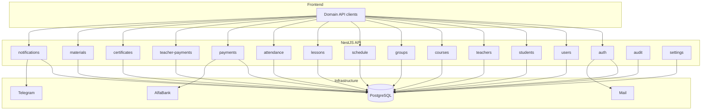
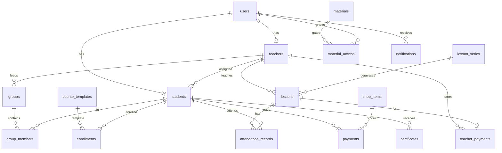

# LongHua CRM v2 — План миграции к Domain-Driven Architecture

**Статус:** архитектурный план (код не изменялся)  
**Дата:** 2026-06-28  
**Контекст:** не production-ветка; БД можно пересоздать; старые миграции не сохраняем.

---

## 1. Текущее состояние

### 1.1 Backend — слои

```
Frontend (React)
    ↓  ~90% через api.entities.* (generic CRUD)
    ↓  ~10% dedicated (/schedule, /auth, /alfabank, /material-access, /functions)
EntitiesController  (/api/entities/:entity)
    ↓
EntityMutationOrchestratorService  ← switch по entity name, маршрутизация в домены
    ↓
EntityRepositoryService  ← generic TypeORM + policy + mapping + enrichment
    ↓
CRM_ENTITY_CLASS_MAP (17 имён) → TypeORM entities (27 таблиц)
    ↓
PostgreSQL
```

Параллельно существуют **частично выделенные домены** без полного repository layer:

| Модуль | Controller | Repository | Прямой TypeORM |
|--------|------------|------------|----------------|
| auth | ✓ | `pending-registration.repository` | pending-registration.service |
| users | ✓ | `users.repository` | role-entity-sync, profile-relations |
| schedule | ✓ (availability only) | — | 10+ services с `@InjectRepository` / `getRepository` |
| payments | ✗ | — | payment.service |
| students | ✗ | — | student-balance.service |
| entities | ✓ (generic + material-access) | — | entity-repository (god-service) |
| alfabank | ✓ | — | alfabank.service |
| jobs | ✓ | — | jobs.service → EntityRepositoryService |
| settings | ✗ | — | settings.service → EntityRepositoryService |
| files | ✓ | — | secure-files.service |
| legacy | ✓ | — | — |

**Dedicated repository files:** только 2 (`users.repository.ts`, `pending-registration.repository.ts`).

### 1.2 Generic Entity Layer — точки использования

| Компонент | Файлы / роль |
|-----------|--------------|
| `EntityRepositoryService` | `entities.controller`, `entity-mutation-orchestrator`, `settings.service`, `jobs.service`, `alfabank.service` |
| `EntitiesController` | `GET/POST/PATCH/DELETE /entities/:entity` — единственная точка generic CRUD |
| `EntityMutationOrchestratorService` | Делегирует Payment→payments, Lesson→schedule, Student/Teacher→users, Material→schedule+files |
| `CRM_ENTITY_CLASS_MAP` | `entity-registry.ts` — 17 API-имён → entity classes |
| `entity-names.json` | `shared/` + копия в API — контракт с frontend |
| `EntityAccessService` | Централизованные ownership/CRUD permissions для всех generic entities |
| `LegacyModule` | `GET /apps/public/prod/public-settings/by-id/longhua-crm` |
| `LegacyController` | Дублирует `GET /auth/public-settings` |

### 1.3 JSONB / json_record

| Артефакт | Статус |
|----------|--------|
| `json_record` / `JsonRecordEntity` | **Не найдено** в runtime-коде |
| JSONB в entity definitions | **Удалено** (миграции 0010+) |
| JSONB в старых migrations | Только исторические файлы `1730000000000`–`0010` |
| Denormalized text/array поля | **Фактический legacy:** `student_name`, `teacher_name` на `lessons`, comma-separated ids в старых данных (уже мигрировано в join-таблицы) |

### 1.4 Текущие entities (27 таблиц)

| Entity / таблица | Назначение | TypeORM relations |
|------------------|------------|-------------------|
| `users` | Auth + role | Почти нет |
| `pending_registrations` | Pre-verify signup | — |
| `students` | Профиль ученика, `lesson_balance` | UUID refs |
| `teachers` | Профиль преподавателя | UUID refs |
| `lessons` | Урок (individual + group) | UUID refs + denorm names |
| `lesson_students` | Attendance / group members | UUID refs |
| `lesson_series` | Recurring template | UUID refs |
| `lesson_series_students` | Students in series | UUID refs |
| `lesson_series_exclusions` | Skip dates | UUID refs |
| `schedule_slots` | Open slots (legacy?) | **0 frontend usage** |
| `teacher_availability` | Shell (только teacher_id) | Заменён slots |
| `teacher_availability_slots` | Weekly availability | UUID refs |
| `teacher_availability_bookings` | Booking link lesson↔slot | UUID refs |
| `courses` | **Progress tracking** per student (не каталог) | UUID refs |
| `course_folders` | Material tree | UUID refs |
| `lesson_materials` | Files/content | UUID refs |
| `lesson_material_links` | Lesson↔material M:N | UUID refs |
| `lesson_material_tags` | Tags | UUID refs |
| `material_access` | User↔material ACL | UUID refs |
| `payments` | Payments | **Единственный** `@ManyToOne` → student |
| `teacher_payments` | Salary per lesson | UUID refs |
| `shop_items` | Catalog (packages/courses) | — |
| `alfa_bank_orders` | **@deprecated** legacy | — |
| `lesson_balances` | **@deprecated** | — |
| `app_settings` | Key-value config | — |
| `welcome_page_settings` | CMS key-value | — |
| `audit_logs` | Audit trail | — |

### 1.5 Frontend — привязка к API

| API слой | Файл | Использование |
|----------|------|---------------|
| Generic entities | `src/api/entities.js` | Авто-клиенты для 17 entity names + User |
| Auth | `src/api/auth.js` | Login, register, verify, me |
| Schedule | `src/api/schedule.js` | Availability check (2 call sites) |
| Functions | `src/api/functions.js` | backup, webhook, alfaBankInit |
| AlfaBank | `src/api/alfabank.js` | Offline payment |
| Material access | `src/lib/materialAccess.js` | Dedicated `/material-access/*` |
| Uploads | `src/api/http.js` | `/uploads` multipart |

**Generic entity call volume (top):** Teacher (31), Student (29), Lesson (25), LessonMaterial (14), Course (10), Payment (9), ShopSettings (9), AppSettings (8).

**Страницы с высокой зависимостью от generic API:**  
`Profile`, `Schedule`, `UserManagement`, `MaterialsHub`, `WindowsFileBrowser`, `ShopSettingsAdmin`, `TelegramSettings`, `TeacherDashboard`, `Payments`, `Analytics`, `ExportData`.

**Dedicated endpoints:** auth, schedule availability, material-access, uploads, functions, alfabank — менее 15% вызовов.

---

## 2. Проблемы текущей архитектуры

### 2.1 Structural

1. **Generic EntitiesModule — god layer.** Один HTTP surface (`/entities/:name`) скрывает 17 разных доменов. Frontend не знает domain boundaries.
2. **EntityMutationOrchestratorService — god router.** Switch по строковому имени entity; бизнес-правила размазаны между orchestrator, repository, schedule, payments, users.
3. **EntityRepositoryService — god repository.** List/filter/save + authorization + record mapping + schedule enrichment + file URL masking + shop/welcome mappers.
4. **Нет единого Repository Layer.** 2 repository-файла vs ~15 сервисов с прямым TypeORM.
5. **EntityAccessService — centralized policy monolith.** Permissions для всех entities в одном файле; блокирует независимое развитие доменов.
6. **Circular module coupling.** `EntitiesModule ↔ SecureFilesModule` (forwardRef), hub-зависимости от Entities в settings/jobs/alfabank.
7. **Legacy compatibility endpoints.** `LegacyModule`, deprecated auth verify-code, deprecated `alfa_bank_orders`.

### 2.2 Data model

1. **Denormalization.** `lessons` хранит teacher/student names; `courses` — student_name; дублирование данных.
2. **Conceptual overlap.** `courses` (progress) vs `shop_items` (catalog) vs `Course` API name — путаница.
3. **Dead/deprecated tables.** `lesson_balances`, `alfa_bank_orders`, `teacher_availability` (shell), `schedule_slots` (unused).
4. **Weak relational model.** 26/27 entities без TypeORM relations; FK только на уровне колонок.
5. **Group lessons.** Group membership через `lesson_students` + denorm fields на `lessons`; нет entity Group.
6. **Missing domains.** Certificates, Notifications — отсутствуют.

### 2.3 Frontend

1. **Generic CRUD antipattern.** `api.entities.Lesson.update()` не выражает domain intent (completeLesson, cancelLesson).
2. **entity-names.json** — shared contract между frontend и backend; изменение схемы ломает оба слоя неявно.
3. **Split routing** (`App.jsx` + `pages.config.js` + `routing.js`) усложняет добавление domain pages.

---

## 3. Целевая архитектура

### 3.1 Принципы

```
Controller  →  HTTP, validation (DTO), auth guards
Service     →  Business logic, transactions, domain rules
Repository  →  TypeORM queries, persistence only
Entity      →  Table mapping, relations
PostgreSQL  →  Normalized schema, FK constraints, no JSONB for business data
```

- **Один модуль = один bounded context** (students, teachers, schedule, …).
- **Нет generic CRUD.** Каждый домен exposes explicit REST endpoints.
- **Cross-domain calls** только через exported service interfaces, не через generic repository.
- **Events optional later;** на v2 достаточно явных service calls.

### 3.2 Целевая diagram



---

## 4. Новая структура модулей

```
apps/api/src/modules/

auth/
  auth.controller.ts
  auth.service.ts
  pending-registration.repository.ts
  verification-email.service.ts
  dto/

users/
  user.entity.ts              ← co-located entity
  users.controller.ts
  users.service.ts
  users.repository.ts
  role.service.ts             ← ex role-entity-sync
  dto/

students/
  student.entity.ts
  students.controller.ts
  students.service.ts
  students.repository.ts
  student-balance.service.ts
  dto/

teachers/
  teacher.entity.ts
  teachers.controller.ts
  teachers.service.ts
  teachers.repository.ts
  dto/

courses/
  course.entity.ts            ← catalog / program template
  enrollment.entity.ts        ← ex `courses` table semantics
  courses.controller.ts
  enrollments.controller.ts
  courses.service.ts
  enrollments.service.ts
  courses.repository.ts
  enrollments.repository.ts
  dto/

groups/
  group.entity.ts
  group-member.entity.ts
  groups.controller.ts
  groups.service.ts
  groups.repository.ts
  dto/

schedule/
  availability-slot.entity.ts
  lesson-series.entity.ts
  series-student.entity.ts
  series-exclusion.entity.ts
  availability-booking.entity.ts
  schedule.controller.ts      ← расширить (не только availability)
  schedule.service.ts
  series.service.ts
  availability.service.ts
  *.repository.ts
  dto/

lessons/
  lesson.entity.ts
  lessons.controller.ts
  lessons.service.ts
  lessons.repository.ts
  lesson-lifecycle.service.ts ← complete/cancel/reschedule
  dto/

attendance/
  attendance.entity.ts        ← ex lesson_students
  attendance.controller.ts
  attendance.service.ts
  attendance.repository.ts
  dto/

payments/
  payment.entity.ts
  shop-item.entity.ts
  payments.controller.ts
  shop.controller.ts
  payments.service.ts
  payments.repository.ts
  dto/

teacher-payments/             ← или внутри teachers/
  teacher-payment.entity.ts
  teacher-payments.controller.ts
  teacher-payments.service.ts
  teacher-payments.repository.ts

certificates/
  certificate.entity.ts
  certificates.controller.ts
  certificates.service.ts
  certificates.repository.ts
  dto/

materials/
  material.entity.ts
  material-folder.entity.ts
  material-link.entity.ts
  material-tag.entity.ts
  material-access.entity.ts
  materials.controller.ts
  material-access.controller.ts
  files.controller.ts         ← ex secure-files
  materials.service.ts
  material-access.service.ts
  files.service.ts
  *.repository.ts
  dto/

notifications/
  notification.entity.ts
  notifications.controller.ts
  notifications.service.ts
  notifications.repository.ts
  telegram/                   ← delivery adapter
    telegram.service.ts

audit/
  audit-log.entity.ts
  audit.service.ts
  audit.repository.ts

settings/
  app-setting.entity.ts
  welcome-content.entity.ts   ← или merge в app_settings
  settings.controller.ts
  settings.service.ts
  settings.repository.ts

integrations/                 ← ex alfabank + webhooks + functions
  alfabank/
  webhooks/
```

**Shared (не domain):**

```
common/
  guards/
  decorators/
  filters/
  pipes/
database/
  migrations/                 ← ONE initial migration v2
  data-source.ts
```

---

## 5. Новая доменная модель

### 5.1 Mapping: текущее → v2

| v2 Domain | Решение | Источник |
|-----------|---------|----------|
| **User** | Оставить | `users` |
| **Role** | Enum на User (`admin\|teacher\|student\|pending`); отдельная таблица roles — только если нужны custom permissions | `users.role` |
| **Student** | Оставить, co-locate в students module | `students` |
| **Teacher** | Оставить | `teachers` |
| **Course** | **Новый смысл:** каталог программ/шаблонов | Частично из `shop_items` (type=course) |
| **Enrollment** | **Переименовать семантику** ex-`courses` | `courses` → `enrollments` |
| **Group** | **Создать** | NEW — для group lessons |
| **Lesson** | Оставить, убрать denorm columns | `lessons` |
| **Schedule** | Availability + series | `teacher_availability_slots`, `lesson_series*`, `teacher_availability_bookings` |
| **Attendance** | Переименовать | `lesson_students` → `attendance_records` |
| **Payment** | Оставить | `payments` |
| **TeacherPayment** | Оставить | `teacher_payments` |
| **Certificate** | **Создать** | NEW |
| **Material** | Объединить material entities | `lesson_materials`, folders, links, tags, access |
| **Notification** | **Создать** | NEW (+ Telegram as channel) |

### 5.2 Объединить

| Что | Во что | Причина |
|-----|--------|---------|
| `shop_items` (packages) + payment catalog logic | `payments/shop` module | Единый commerce domain |
| `welcome_page_settings` + часть `app_settings` | `settings` module с typed keys | Меньше key-value таблиц |
| Material access + secure files | `materials` module | Один bounded context |
| `EntityAccessService` permissions | Per-domain guards/policies | Разделение ответственности |

### 5.3 Удалить (таблицы)

| Таблица | Причина |
|---------|---------|
| `alfa_bank_orders` | Deprecated; payments.external_id + provider |
| `lesson_balances` | Deprecated; balance на `students.lesson_balance` |
| `teacher_availability` | Shell без данных; slots в `teacher_availability_slots` |
| `schedule_slots` | 0 frontend usage; функциональность в lessons/series |
| Denorm columns на `lessons` | `teacher_name`, `student_name`, `student_ids` text — заменить joins |

### 5.4 Создать заново

| Entity | Назначение |
|--------|------------|
| `groups` | Группа учеников (name, teacher_id, status) |
| `group_members` | group_id + student_id (M:N) |
| `course_templates` | Каталог программ (name, type, total_lessons, price ref) |
| `certificates` | student_id, enrollment_id, issued_at, template, file_url |
| `notifications` | user_id, channel, type, payload refs, status, sent_at |
| `payment_provider_orders` | Optional: external order tracking (ex alfa_bank_orders clean) |

---

## 6. Новая структура базы данных (v2 greenfield)

**Правила:** UUID PK, `timestamptz` audit columns, FK constraints, NO JSONB для business entities, M:N через join tables.

### 6.1 Core identity

```sql
-- users
id, email, password_hash, role, status, onboarding_state,
first_name, last_name, phone, email_verified,
telegram_id, verification_code, ...,
created_at, updated_at

-- pending_registrations (auth pre-verify)
id, email, password_hash, status, verification_code, expires_at, ...

-- students
id, user_id FK→users UNIQUE, name, first_name, last_name,
email, phone, telegram_id,
assigned_teacher_id FK→teachers,
lesson_balance INT DEFAULT 0,
status, start_date, birthday, notes,
created_at, updated_at

-- teachers
id, user_id FK→users UNIQUE, name, first_name, last_name,
email, phone, telegram_id, status, notes,
created_at, updated_at
```

### 6.2 Courses & enrollment

```sql
-- course_templates (catalog)
id, name, course_type ENUM, total_lessons, description,
shop_price NUMERIC, is_active, created_at, updated_at

-- enrollments (ex courses — student progress)
id, student_id FK→students, course_template_id FK→course_templates NULL,
course_name, completed_lessons, total_lessons, status,
start_date, notes, created_at, updated_at

-- groups
id, name, teacher_id FK→teachers, status, created_at, updated_at

-- group_members
id, group_id FK→groups, student_id FK→students,
UNIQUE(group_id, student_id)
```

### 6.3 Schedule & lessons

```sql
-- teacher_availability_slots
id, teacher_id FK→teachers, day_of_week, time_from, time_to,
created_at, updated_at

-- lesson_series
id, teacher_id FK→teachers, status, start_date, start_time,
duration, lesson_format, meeting_link, repeat_weekly, notes,
created_at, updated_at

-- lesson_series_students
id, series_id FK→lesson_series, student_id FK→students,
UNIQUE(series_id, student_id)

-- lesson_series_exclusions
id, series_id FK→lesson_series, exclusion_date DATE,
UNIQUE(series_id, exclusion_date)

-- lessons
id, teacher_id FK→teachers, series_id FK→lesson_series NULL,
group_id FK→groups NULL,
primary_student_id FK→students NULL,  -- для individual
date, start_time, duration, status, lesson_type, lesson_format,
meeting_link, notes, teacher_payment_id FK NULL,
created_at, updated_at
-- БЕЗ teacher_name, student_name denorm

-- teacher_availability_bookings
id, teacher_id FK→teachers, lesson_id FK→lessons, status,
created_at, updated_at

-- attendance_records (ex lesson_students)
id, lesson_id FK→lessons, student_id FK→students,
attendance_status ENUM, balance_deducted BOOLEAN,
UNIQUE(lesson_id, student_id),
created_at, updated_at
```

### 6.4 Payments & commerce

```sql
-- shop_items (packages / purchasable products)
id, name, type ENUM(package|course), lessons_count, price NUMERIC,
course_template_id FK NULL, is_active, sort_order,
created_at, updated_at

-- payments
id, student_id FK→students, amount, currency, status, provider,
shop_item_id FK NULL, enrollment_id FK NULL, lesson_id FK NULL,
lessons_added, order_number, external_id, paid_at, notes,
created_at, updated_at

-- teacher_payments
id, teacher_id FK→teachers, lesson_id FK→lessons,
amount, status, notes, created_at, updated_at
```

### 6.5 Materials

```sql
-- material_folders (ex course_folders)
id, course_template_id FK NULL, parent_id FK self, name, sort_order, ...

-- materials (ex lesson_materials)
id, folder_id FK, title, file_url, file_type, description, ...

-- material_links (lesson ↔ material)
id, lesson_id FK→lessons, material_id FK→materials, UNIQUE pair

-- material_tags
id, material_id FK, tag

-- material_access
id, user_id FK→users, material_id FK→materials, access BOOL,
granted_by_role, granted_by_user_id,
UNIQUE(user_id, material_id)
```

### 6.6 Certificates & notifications

```sql
-- certificates
id, student_id FK, enrollment_id FK NULL,
title, issued_at, file_url, issued_by_user_id FK,
created_at

-- notifications
id, user_id FK→users, channel ENUM(telegram|email|in_app),
type, title, body, status, read_at, sent_at,
reference_type, reference_id,
created_at
```

### 6.7 System

```sql
-- app_settings (key-value for infra secrets only)
id, key UNIQUE, value, description, updated_at

-- audit_logs
id, actor_user_id, action, entity_type, entity_id, summary, created_at
```

### 6.8 ER overview



---

## 7. Frontend — целевой API слой

### 7.1 Заменить `src/api/entities.js`

```
src/api/
  http.js                    ← keep
  auth.api.js                ← ex auth.js
  users.api.js               ← list/update users (admin)
  students.api.js            ← CRUD + balance
  teachers.api.js
  courses.api.js             ← catalog templates
  enrollments.api.js         ← ex Course entity usage
  groups.api.js
  schedule.api.js            ← expand: series, availability
  lessons.api.js             ← create, update, complete, cancel
  attendance.api.js
  payments.api.js
  shop.api.js
  teacher-payments.api.js
  certificates.api.js
  materials.api.js           ← folders, files, access
  notifications.api.js
  settings.api.js
  integrations.api.js        ← alfabank, backup, webhooks
  index.js                   ← compose api.*
```

### 7.2 Migration map: generic entity → domain API

| Old `api.entities.X` | New client | Example method |
|---------------------|------------|----------------|
| `Student.*` | `students.api.js` | `getById`, `update`, `list` |
| `Teacher.*` | `teachers.api.js` | same |
| `Lesson.*` | `lessons.api.js` | `create`, `complete`, `cancel` |
| `LessonStudent.*` | `attendance.api.js` | `markAttended` |
| `Course.*` | `enrollments.api.js` | progress CRUD |
| `Payment.*` | `payments.api.js` | `create`, `list` |
| `ShopSettings.*` | `shop.api.js` | catalog admin |
| `LessonMaterial.*` | `materials.api.js` | CRUD + upload |
| `CourseFolder.*` | `materials.api.js` | folder tree |
| `MaterialAccess.*` | `materials.api.js` | access sync |
| `AppSettings.*` | `settings.api.js` | get/set |
| `WelcomePageSettings.*` | `settings.api.js` | welcome content |
| `TeacherAvailability.*` | `schedule.api.js` | slots CRUD |
| `User.*` | `users.api.js` | admin user mgmt |

### 7.3 Frontend migration order (by page)

| Priority | Pages | Old dependency |
|----------|-------|----------------|
| P0 | `Login`, `PendingApproval`, `AuthContext` | auth (already dedicated) |
| P1 | `UserManagement`, `Profile` | Student, Teacher, User |
| P2 | `Schedule`, `TeacherSchedule`, `TeacherDashboard` | Lesson, Teacher, Student |
| P3 | `StudentDashboard`, `StudentLessons`, `StudentDetail` | Lesson, Student, Payment |
| P4 | `MaterialsHub`, `WindowsFileBrowser`, material modals | LessonMaterial, CourseFolder, MaterialAccess |
| P5 | `Payments`, `ShopSettingsAdmin`, `TopUpModal` | Payment, ShopSettings |
| P6 | `AdminSettings`, `TelegramSettings`, `WelcomePageEditor` | AppSettings, WelcomePageSettings |
| P7 | `Analytics`, `ExportData`, `Salary` | read-only aggregates |

**Удалить после миграции:** `shared/entity-names.json`, `src/api/entities.js`, `sync:entities` script.

---

## 8. План миграции по этапам

### Phase 0 — Foundation (1–2 недели)

- [ ] Зафиксировать v2 schema (этот документ → ADR)
- [ ] Удалить все migrations; создать `1731000000000-InitialSchemaV2.ts`
- [ ] Bootstrap Nest module skeleton (empty controllers/services/repositories)
- [ ] Настроить `database/` co-location policy: entity рядом с module
- [ ] CI: build + migration run on empty DB

### Phase 1 — Identity domain (1 неделя)

- [ ] `auth` + `users` modules — перенос без generic layer
- [ ] `students` + `teachers` modules с repositories
- [ ] Seed admin user
- [ ] Frontend: `auth.api.js`, `users.api.js`, `students.api.js`, `teachers.api.js`
- [ ] Migrate `UserManagement`, `Profile`

### Phase 2 — Schedule & lessons (2 недели)

- [ ] `schedule`, `lessons`, `attendance`, `groups` modules
- [ ] Перенести logic из `lesson-orchestrator`, `lesson-series-*`, `teacher-availability-*`
- [ ] Explicit endpoints: `POST /lessons`, `PATCH /lessons/:id/complete`, etc.
- [ ] Frontend: schedule/lessons/attendance APIs
- [ ] Migrate `Schedule`, `TeacherSchedule`, `TeacherDashboard`

### Phase 3 — Payments & commerce (1 неделя)

- [ ] `payments`, `shop`, `integrations/alfabank`
- [ ] Удалить `alfa_bank_orders`; использовать `payments.external_id`
- [ ] Frontend: payments/shop APIs
- [ ] Migrate `Payments`, `ShopSettingsAdmin`, `TopUpModal`

### Phase 4 — Materials (1–2 недели)

- [ ] `materials` module (files + access + folders)
- [ ] Убрать forwardRef cycle (materials owns access check)
- [ ] Frontend: materials API
- [ ] Migrate `MaterialsHub`, all material components

### Phase 5 — Enrollments, certificates, notifications (1–2 недели)

- [ ] `courses` (templates) + `enrollments` (ex courses table)
- [ ] `certificates` (new)
- [ ] `notifications` + telegram adapter
- [ ] Migrate remaining admin pages

### Phase 6 — Settings, audit, jobs (1 неделя)

- [ ] `settings` module (ex AppSettings/Welcome)
- [ ] `audit` — keep global
- [ ] Refactor `jobs` — domain services instead of EntityRepositoryService

### Phase 7 — Legacy removal (1 неделя)

- [ ] Delete `EntitiesModule`, `EntityRepositoryService`, `EntityMutationOrchestratorService`
- [ ] Delete `EntitiesController`, `entity-registry.ts`, `entity-names.json`
- [ ] Delete `LegacyModule`, `LegacyController`
- [ ] Delete `FunctionsModule` — split into domain/integration endpoints
- [ ] Remove `record.util.ts` mappers where DTOs replace Record<string, unknown>
- [ ] Frontend: delete `entities.js`

### Phase 8 — Hardening

- [ ] E2E tests per domain
- [ ] API documentation (OpenAPI per module)
- [ ] Performance indexes review
- [ ] Security audit per domain guards

---

## 9. Что удалить

### Backend code

| Path / component | Когда |
|------------------|-------|
| `modules/entities/` (entire module) | Phase 7 |
| `common/constants/entity-registry.ts` | Phase 7 |
| `common/constants/entity-names.ts` + `.json` | Phase 7 |
| `common/utils/record.util.ts` | Phase 7 (after DTO migration) |
| `modules/legacy/` | Phase 7 |
| `modules/functions/` | Phase 6–7 |
| `modules/shop/shop.mapper.ts` | Phase 3 (move to payments) |
| `modules/welcome/welcome.mapper.ts` | Phase 6 (move to settings) |
| `database/migrations/1730000000000–0020` | Phase 0 |
| `database/scripts/import-json.ts` | Phase 0 (rewrite or drop) |

### Database tables

| Table | Phase |
|-------|-------|
| `alfa_bank_orders` | Phase 0 (not in v2 schema) |
| `lesson_balances` | Phase 0 |
| `teacher_availability` | Phase 0 |
| `schedule_slots` | Phase 0 |
| `welcome_page_settings` | Phase 6 (merge to settings) |

### Frontend

| Path | Phase |
|------|-------|
| `src/api/entities.js` | Phase 7 |
| `shared/entity-names.json` | Phase 7 |
| `npm run sync:entities` | Phase 7 |
| Deprecated `auth.verifyCode/resendCode` | Phase 1 |

---

## 10. Что переписать

| Component | From | To |
|-----------|------|-----|
| All CRUD | `EntityRepositoryService` + Record maps | Domain repositories + typed DTOs |
| Lesson lifecycle | `EntityMutationOrchestrator` + generic PATCH | `LessonsService.complete/cancel/reschedule` |
| Payment creation | Split alfabank + entities + payment.service | `PaymentsService` + `AlfabankIntegration` |
| Material access | `EntityAccessService` monolith | `MaterialsAccessPolicy` in materials module |
| User/role sync | `RoleEntitySyncService` via generic create | `StudentsService.createFromUser` |
| Profile deletion | `ProfileRelationsService` cross-domain deletes | Orchestrated saga or FK CASCADE + domain cleanup |
| Jobs | `JobsService` via generic repo | Domain cron services (schedule, notifications) |
| Settings | `SettingsService` → EntityRepository | `SettingsRepository` direct |
| Frontend data layer | `api.entities.*` | Domain `*.api.js` modules |

---

## 11. Риски

| Risk | Severity | Mitigation |
|------|----------|------------|
| Big-bang frontend migration | **High** | Strangler pattern: domain APIs parallel to generic, feature flags per page |
| Business logic loss in orchestrator switch | **High** | Inventory all `EntityMutationOrchestrator` branches → acceptance tests before delete |
| Denorm column removal breaks UI | **Medium** | API response DTOs include joined names; contract tests |
| Group lessons regression | **Medium** | Explicit group module + attendance tests |
| Certificate/notification scope creep | **Low** | MVP: certificate PDF stub + notification log; Telegram later |
| Developer habit of generic CRUD | **Medium** | ESLint rule: ban imports from deleted entities.js |
| Module boundary disputes (courses vs enrollments) | **Medium** | ADR per bounded context; code review checklist |

---

## 12. Порядок реализации (recommended)

```
Week 1–2:  Phase 0 (schema v2, module skeleton, wipe migrations)
Week 3:    Phase 1 (auth, users, students, teachers) + UserManagement/Profile FE
Week 4–5:  Phase 2 (schedule, lessons, attendance, groups) + Schedule FE
Week 6:    Phase 3 (payments, shop, alfabank) + Payments FE
Week 7–8:  Phase 4 (materials) + MaterialsHub FE
Week 9–10: Phase 5 (enrollments, certificates, notifications)
Week 11:   Phase 6 (settings, audit, jobs refactor)
Week 12:   Phase 7 (delete EntitiesModule, entities.js, legacy)
Week 13+:  Phase 8 (tests, docs, hardening)
```

### Definition of Done (v2)

- [ ] Zero imports of `EntityRepositoryService`, `CRM_ENTITY_CLASS_MAP`, `entities.js`
- [ ] Every domain module has controller + service + repository
- [ ] One greenfield migration creates full schema
- [ ] All FK constraints enforced in PostgreSQL
- [ ] No JSONB columns on business tables
- [ ] Frontend uses only `*.api.js` domain clients
- [ ] `npm run build` passes
- [ ] Core user flows work: register → login → schedule lesson → complete → payment → material access

---

## Appendix A — Inventory: EntityMutationOrchestrator branches

Must preserve as explicit domain operations:

| Entity | Create | Update | Delete |
|--------|--------|--------|--------|
| Payment | PaymentService.create | PaymentService.update | PaymentService.delete |
| ShopSettings | saveShopSettings | updateShopSettings | generic |
| WelcomePageSettings | upsertWelcome | upsertWelcome | — |
| Lesson | createLesson / createRecurring | updateLesson | deleteLesson |
| TeacherAvailability | createAvailability | updateAvailability | deleteSlots |
| LessonMaterial | createMaterial + grant access | updateMaterial | — |
| CourseFolder | create | update | delete |
| Student | roleEntitySync.create | generic + balance audit | profileRelations.delete |
| Teacher | roleEntitySync.create | generic | profileRelations.delete |
| LessonStudent | generic + refresh fields | generic + refresh | generic + refresh |
| MaterialAccess | generic + audit | generic + audit | — |
| AppSettings | — | generic + audit | — |

---

## Appendix B — Services with direct TypeORM (must become repositories)

| Service | Target repository |
|---------|-------------------|
| payment.service | payments.repository |
| student-balance.service | students.repository |
| lesson-repository.service | lessons.repository |
| lesson-orchestrator.service | lessons.service (keep orchestration) |
| lesson-series.service | series.repository |
| teacher-availability.service | availability.repository |
| course-folder.service | materials.repository |
| material-access-*.service | material-access.repository |
| secure-files.service | materials-files.repository |
| alfabank.service | payments.repository + shop.repository |
| profile-relations.service | split across domain delete methods |
| entity-enrichment.service | read joins in domain services |
| audit.service | audit.repository (exists pattern) |

---

*Документ подготовлен на основе статического анализа `apps/api/src` и `src/` без изменения кода.*
