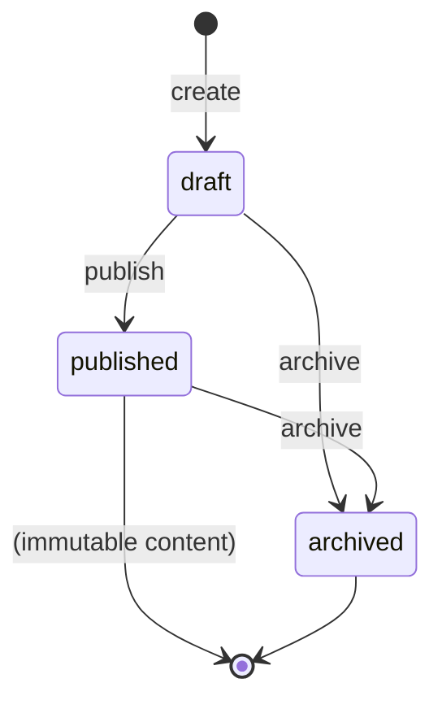
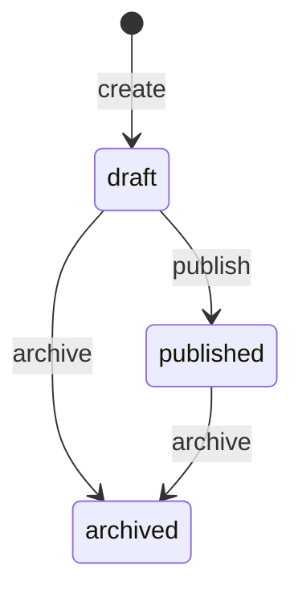
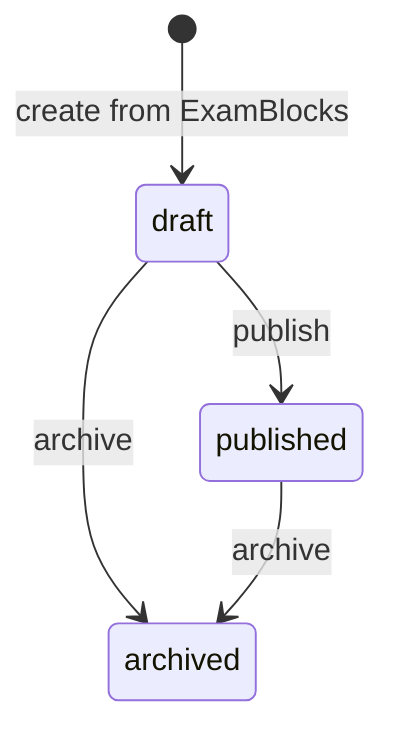
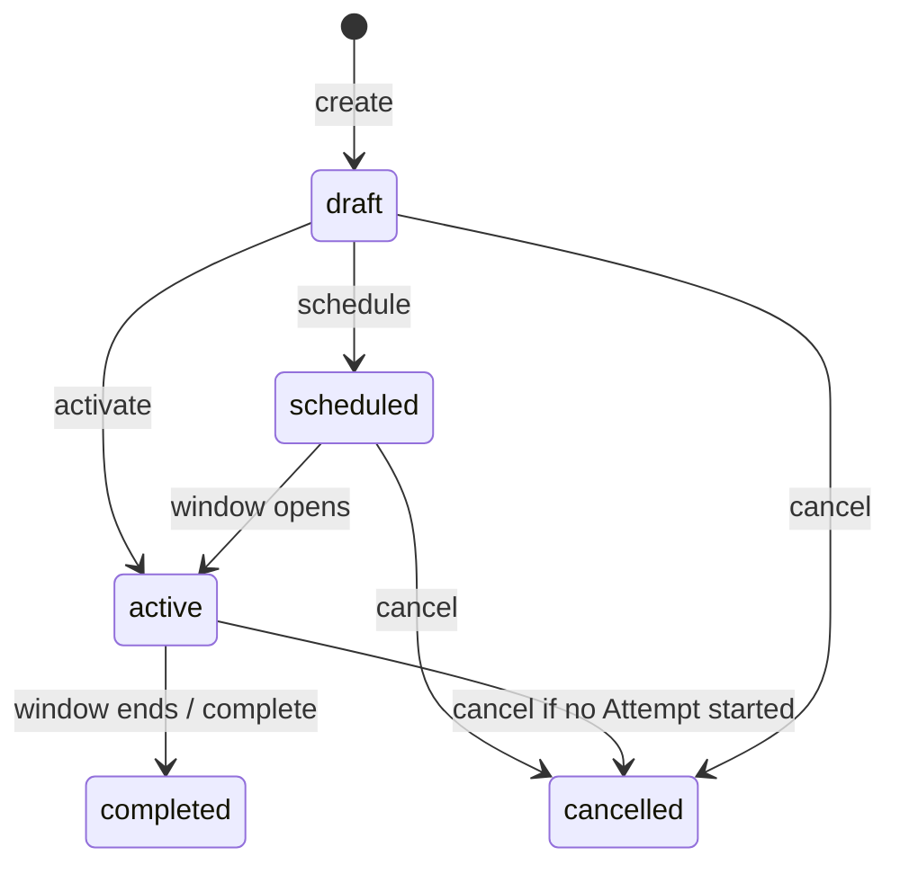
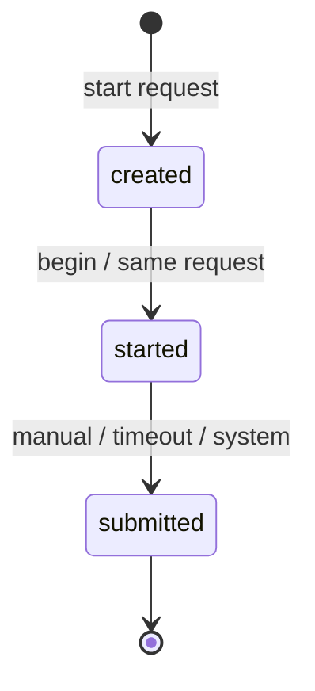
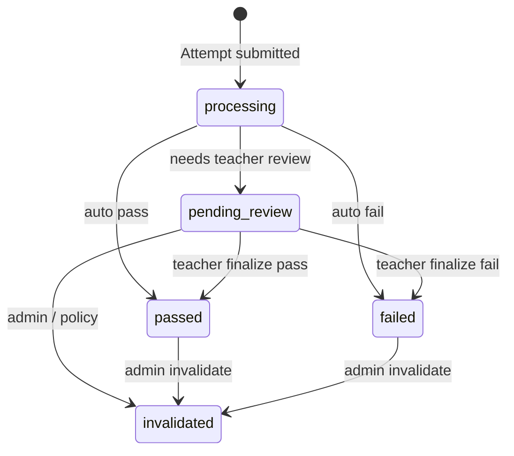

# LongHua Assessment — State Machines

Status: **official architecture** (documentation only — no Entity / migrations / code)  
Related: [domain-model.md](./domain-model.md), [api-contract.md](./api-contract.md), [architecture.md](./architecture.md)  
Aligned with domain-model / api-contract on Attempt, Assignment cancel, Result.

Этот документ фиксирует **допустимые состояния и переходы** основных сущностей Assessment.  
При реализации Entity / сервисов статусы и guards должны соответствовать этому файлу.

---

## Conventions

| Term | Meaning |
|------|---------|
| **Actor** | `admin` \| `teacher` \| `student` (участник) \| `system` (cron / timeout job) |
| **Immutable after publish** | In-place edit запрещён; изменения = новый объект (clone) |
| **Terminal** | Из состояния нет исходящих бизнес-переходов (кроме редкого admin invalidate) |

Права ниже — целевые; точный ACL — в `AssessmentAccessService` при реализации.

---

## 1. Question

### 1.1. States

| State | Meaning |
|-------|---------|
| `draft` | Редактируется; можно менять stem/answers/attachments |
| `published` | Доступен для включения в ExamBlock / Exam |
| `archived` | Снят с использования в **новых** генерациях |

### 1.2. Transitions

| From | To | Allowed? | Who | Cause |
|------|-----|----------|-----|--------|
| — | `draft` | yes | `admin`, `teacher` | Create question |
| `draft` | `published` | yes | `admin`, `teacher` | Explicit publish |
| `draft` | `archived` | yes | `admin`, `teacher` | Soft-retire without publish |
| `published` | `archived` | yes | `admin`, `teacher` | Retire from bank pool |
| `published` | `draft` | **no** | — | — |
| `archived` | `published` | **no** | — | — |
| `archived` | `draft` | **no** | — | — |

### 1.3. Forbidden / notes

- Редактирование полей вопроса в `published` / `archived` → запрещено (нужен clone → новый `draft`).
- Уже созданные Exam / Snapshot **не** меняются при archive Question.
- Удаление (`DELETE`) — только из `draft`, если вопрос нигде не заморожен в Exam (деталь Entity-фазы).

---

## 2. ExamBlock

### 2.1. States

| State | Meaning |
|-------|---------|
| `draft` | Каркас редактируется |
| `published` | Можно строить/публиковать связанные Blueprint |
| `archived` | Не используется для новых Exam |

### 2.2. Transitions

| From | To | Allowed? | Who | Cause |
|------|-----|----------|-----|--------|
| — | `draft` | yes | `admin`, `teacher` | Create |
| `draft` | `published` | yes | `admin`, `teacher` | Publish |
| `draft` | `archived` | yes | `admin`, `teacher` | Archive |
| `published` | `archived` | yes | `admin`, `teacher` | Archive |
| `published` | `draft` | **no** | — | Edit via **new** template object |
| `archived` | `*` | **no** | — | No re-publish |

### 2.3. Notes

После `publish` редактирование запрещено.  
Изменения = создание **нового** ExamTemplate (в текущей модели без Version-таблиц).

---

## 3. ExamBlock publish notes

### 3.1. States

| State | Meaning |
|-------|---------|
| `draft` | Правила секций / weight редактируются; возможен preview |
| `published` | Можно материализовать Exam; состав правил заморожен |
| `archived` | Не используется для новых Exam |

### 3.2. Transitions

| From | To | Allowed? | Who | Cause |
|------|-----|----------|-----|--------|
| — | `draft` | yes | `admin`, `teacher` | Create |
| `draft` | `published` | yes | `admin`, `teacher` | Publish (validate weights / pool) |
| `draft` | `archived` | yes | `admin`, `teacher` | Archive |
| `published` | `archived` | yes | `admin`, `teacher` | Archive |
| `published` | `draft` | **no** | — | — |
| `archived` | `published` | **no** | — | — |

### 3.3. Notes

- `preview` **не** меняет статус.
- Опубликованный Blueprint не изменяется in-place.
- Уже созданные Exam остаются валидны после archive Blueprint.

---

## 4. Exam

### 4.1. States

| State | Meaning |
|-------|---------|
| `draft` | Материализован из ExamBlocks; meta/rule/rebuild допустимы |
| `published` | Доступен для Assignment / Attempt; состав вопросов + rule immutable |
| `archived` | Новые Assignment/Attempt запрещены; история сохраняется |

### 4.2. Transitions

| From | To | Allowed? | Who | Cause |
|------|-----|----------|-----|--------|
| — | `draft` | yes | `admin`, `teacher` | Create from published ExamBlocks |
| `draft` | `published` | yes | `admin`, `teacher` | Publish |
| `draft` | `archived` | yes | `admin`, `teacher` | Discard draft |
| `published` | `archived` | yes | `admin`, `teacher` | Close exam |
| `published` | `draft` | **no** | — | — |
| `archived` | `published` | **no** | — | — |

### 4.3. Rebuild (not a status)

| Exam state | Rebuild from ExamBlocks | Who | Cause |
|------------|------------------------|-----|--------|
| `draft` | **allowed** | `admin`, `teacher` | Explicit rebuild action |
| `published` | **forbidden** | — | — |
| `archived` | **forbidden** | — | — |

### 4.4. Interaction with Assignment

- Наличие Assignment **не** разблокирует редактирование `published` Exam.
- Если Exam уже назначен (`Assignment` в `scheduled`/`active`), Exam остаётся неизменяемым после publish (как и без Assignment).
- `publish` Exam **не требует** заранее существующих Assignment.
- Новые Assignment допустимы только пока Exam = `published` (не `draft`, не `archived`).

---

## 5. Assignment

### 5.1. States

| State | Meaning |
|-------|---------|
| `draft` | Подготовлено, ещё не в расписании / не видно участникам как доступное |
| `scheduled` | Запланировано на будущее (`valid_from` в будущем) |
| `active` | Участники могут стартовать Attempt |
| `completed` | Окно закончилось / цель достигнута; новые Attempt нельзя |
| `cancelled` | Отменено администратором/преподавателем |

### 5.2. Transitions

| From | To | Allowed? | Who | Cause |
|------|-----|----------|-----|--------|
| — | `draft` | yes | `admin`, `teacher` | Create (Exam must be `published`) |
| `draft` | `scheduled` | yes | `admin`, `teacher` | Set future `valid_from` / explicit schedule |
| `draft` | `active` | yes | `admin`, `teacher`, **`system`** | Activate now / `valid_from` ≤ now |
| `scheduled` | `active` | yes | **`system`** (timer), optionally `admin` | `valid_from` reached |
| `scheduled` | `cancelled` | yes | `admin`, `teacher` | Cancel before start |
| `active` | `completed` | yes | **`system`**, `admin` | `valid_to` passed or manual complete |
| `active` | `cancelled` | **conditional** | `admin`, `teacher` | Cancel **only if no Attempt in `started`** — §5.5 |
| `draft` | `cancelled` | yes | `admin`, `teacher` | Cancel before any attempt |
| `scheduled` | `cancelled` | yes | `admin`, `teacher` | Cancel before window / before attempts |
| `completed` | `*` | **no** | — | Terminal |
| `cancelled` | `*` | **no** | — | Terminal |
| `*` → `draft` | **no** | — | No reopen |

### 5.3. When does Assignment become `active`?

- При создании, если `valid_from` пуст или ≤ now → сразу `active` (или `draft`→`active` одной операцией API).
- Если `valid_from` в будущем → `scheduled`, затем `system` переводит в `active`.
- **Предусловие:** Exam.status = `published`. Иначе create → `400`/`409`.

### 5.4. When does it complete automatically?

- `system`: `valid_to` < now → `active` → `completed`.
- Если `valid_to` null — остаётся `active` до ручного `completed` / `cancelled`.

### 5.5. Cancel rules (official)

| Situation | Cancel Assignment? | HTTP / effect |
|-----------|--------------------|---------------|
| No Attempts at all | **yes** | → `cancelled` |
| Only Attempts in `created` (if exposed) / none `started` | **yes*** | → `cancelled` (*если `created` ещё не `started` — допустимо; после перехода в `started` — нет) |
| ≥1 Attempt in **`started`** | **no** | Backend **`409 Conflict`** |
| Attempts only in **`submitted`** | **yes** | → `cancelled`; история Attempt/Result сохраняется; новые start запрещены |

**Официальное правило:** Assignment можно отменить **только до начала первой попытки в состоянии `started`**.  
Наличие хотя бы одного Attempt со статусом `started` → отмена запрещена.

---

## 6. Attempt (critical)

**Не используются:** `expired`, `abandon`, `void`.  
Потеря соединения / закрытие вкладки / закрытие браузера **не** меняют статус Attempt.

### 6.1. States

| State | Meaning |
|-------|---------|
| `created` | Attempt создан; snapshots созданы |
| `started` | Участник в процессе; autosave разрешён; идёт учёт времени |
| `submitted` | Единственное терминальное состояние сдачи; ответы зафиксированы; создаётся Result |

### 6.2. Field: `submit_reason`

Обязательно заполняется **в момент** перехода `started` → `submitted`. Ровно одно значение на Attempt.

| Value | Meaning | Who triggers |
|-------|---------|--------------|
| `manual` | Участник сам завершил экзамен | участник (`student` / `teacher`-участник) |
| `timeout` | Время истекло; система выполнила submit автоматически | `system` |
| `system` | Завершение по административной / системной причине | `admin` / `system` |

**При окончании времени:** Attempt **не** получает отдельный статус.  
Система **всегда** выполняет submit: `started` → `submitted` с `submit_reason = timeout` (по последнему autosave).

### 6.3. Transitions

| From | To | Allowed? | Who | Cause |
|------|-----|----------|-----|--------|
| — | `created` | yes | участник | Start (active Assignment + published Exam + attempts left) |
| `created` | `started` | yes | same / `system` | Begin timer (`started_at`, `expires_at`) |
| `started` | `submitted` | yes | участник | Submit → `submit_reason=manual` |
| `started` | `submitted` | yes | **`system`** | Timer → `submit_reason=timeout` |
| `started` | `submitted` | yes | `admin` / `system` | Admin force → `submit_reason=system` |
| `submitted` | `started` | **no** | — | — |
| `started` | `expired` | **no** | — | State does not exist |

Рекомендация API: **`POST start` атомарно** `created` → `started` (состояние `created` может быть внутренним).

### 6.4. Lifecycle events (non-status)

| Event | Changes Attempt status? | What happens |
|-------|-------------------------|--------------|
| Autosave | **No** (остаётся `started`) | Пишет AttemptAnswer |
| Close browser / tab | **No** | Last autosave retained; status stays `started` |
| Lose network | **No** | Client retries; server unchanged |
| Reopen exam UI | **No** | Same `started` + saved answers |
| Duration elapsed | **Yes** → `submitted` | Auto-submit, `submit_reason=timeout` → Result |
| Manual submit | **Yes** → `submitted` | `submit_reason=manual` → Result |

### 6.5. Creation rules

- Assignment в `active`;
- Exam = `published`;
- attempts left per Rule;
- нет другого live Attempt (`created`/`started`) на этот Exam для участника.

### 6.6. Forbidden

- Состояние `expired` / `abandon` / `void`.
- Два live Attempt на один Exam для одного участника.
- Возврат из `submitted`.
- Изменение Snapshot после старта.
- Смена статуса из-за UX (закрытие вкладки).
- Более одного `submit_reason` на Attempt.

---

## 7. Result

### 7.1. States

| State | Meaning |
|-------|---------|
| `processing` | Идёт подсчёт / подготовка итога |
| `pending_review` | Нужна проверка преподавателем (есть unscored manual items) |
| `passed` | Итог готов; порог пройден |
| `failed` | Итог готов; порог не пройден |
| `invalidated` | Аннулирован; не для сертификата |

### 7.2. Field: `evaluation_type`

Обязательное поле Result. Ровно одно значение.

| Value | Meaning |
|-------|---------|
| `automatic` | Полностью автоматическая оценка |
| `manual` | Полностью преподавателем |
| `mixed` | Часть auto, часть manual |

Устанавливается при выходе из `processing` (и уточняется при завершении review для `mixed`/`manual`).

### 7.3. Transitions

| From | To | Allowed? | Who | Cause |
|------|-----|----------|-----|--------|
| — | `processing` | yes | `system` | Attempt → `submitted` |
| `processing` | `passed` / `failed` | yes | `system` | Полный auto-score; review не нужен |
| `processing` | `pending_review` | yes | `system` | Есть задания, требующие проверки преподавателем |
| `processing` | `invalidated` | yes | `system`, `admin` | Сбой / политика |
| `pending_review` | `passed` / `failed` | yes | `teacher`, `admin` | Завершение ручной проверки |
| `pending_review` | `invalidated` | yes | `admin` | Аннулирование |
| `passed`/`failed` | `invalidated` | yes | `admin` | Аннулирование |
| `passed` ↔ `failed` auto | **no** | — | Only via explicit future rescore |
| `invalidated` | `*` | **no** | — | Terminal |

**Правило:** `pending_review` используется **только** если экзамен содержит задания, требующие проверки преподавателем.  
Иначе: `processing` → `passed` | `failed` сразу; `evaluation_type = automatic`.

### 7.4. When is Result created?

- При переходе Attempt → `submitted` (любой `submit_reason`).
- Поля score / times / `attempt_number` / `evaluation_type` / status заполняются по ходу SM.
- Автоматический фоновый пересчёт после финального статуса **запрещён**.

---

## 8. Summary table

| Entity | Initial state | Terminal states |
|--------|---------------|-----------------|
| Question | `draft` | `archived` |
| ExamBlock | `draft` | `archived` |
| Exam | `draft` | `archived` |
| Assignment | `draft` | `completed`, `cancelled` |
| Attempt | `created` | **`submitted` only** |
| Result | `processing` | `passed`, `failed`, `invalidated` (`pending_review` — промежуточное) |

---

## 9. Business Invariants

1. **Published objects are not edited in-place.** Changes require a new object (clone).  
2. **Archived objects cannot be published again.**  
3. **Snapshot never changes** after it is written for an Attempt.  
4. **Attempt always has exactly one Snapshot set.**  
5. **One Attempt cannot be in two active states** (`created`/`started`); at most one live Attempt per participant per Exam.  
6. **Assignment cannot become `active`/`scheduled` without Exam `published`.**  
7. **Attempt cannot reopen after `submitted`.**  
8. **Closing the browser/tab does not change Attempt status.**  
9. **Autosave does not change Attempt status.**  
10. **Result is not auto-recalculated** after a final status (except explicit admin invalidate / future explicit rescore).  
11. **Result is always created when Attempt becomes `submitted`.**  
12. **Cancel Assignment does not delete historical Attempts/Results.**  
13. **Rebuild Exam allowed only in `draft`.**  
14. **ExamBlock/Question `published` content is immutable.**  
15. **Only one AssessmentRule store per Exam**; freezes with Exam publish.  
16. **On time expiry the system always performs submit automatically** (`submit_reason=timeout`).  
17. **Attempt never enters a separate `expired` state.**  
18. **Assignment cannot be cancelled after at least one Attempt is `started`** (backend `409`).  
19. **Attempt has exactly one `submit_reason`** when submitted.  
20. **Result always has exactly one `evaluation_type`.**  
21. **`pending_review` is used only when the exam has items requiring teacher review.**

---

## 10. Alignment (scaffold enums → Entity)

При Entity привести scaffold `AttemptStatus` к:

| Official SM | Notes |
|-------------|--------|
| `created` | keep |
| `started` | replaces `in_progress` / `not_started` |
| `submitted` | keep |
| — | **remove** `expired`, `void`, abandon |

Добавить enum/поля: `submit_reason`, Result `evaluation_type`, Result status incl. `pending_review`.

---

## 11. Remaining optional discussions (non-blocking)

1. Expose `created` in API vs atomic start only.  
2. Persist `processing` row vs in-request only (recommend persist).  
3. Assignment create → always `draft` first or skip to `scheduled`/`active`.

**Timeout / cancel / pending_review / evaluation_type — зафиксированы.**

---

## 12. Ready for Entity / migrations?

**Да. Архитектура Assessment по state machines полностью зафиксирована.**

Можно переходить к проектированию Entity и миграций `assessment_*` по:

- [domain-model.md](./domain-model.md)  
- [api-contract.md](./api-contract.md)  
- **этому** state-machine.md  

Код Entity / миграции в рамках этого обновления документации **не создаются**.
