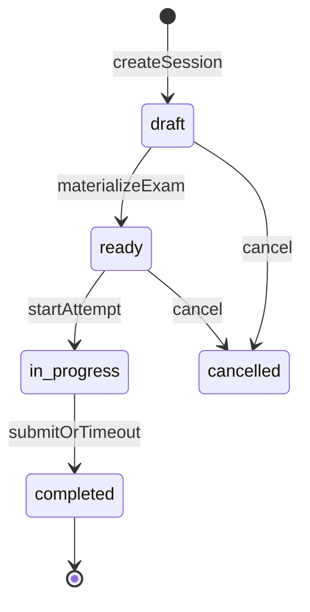

# Exam Academy / HSK Academy — Architecture

Status: **approved + implemented (P0–P6 baseline)**  
Product brand (v1 UI): **HSK Academy**  
Core module: `apps/api/src/modules/exam-academy` (universal international exam prep)  
Frontend: `src/pages/hsk-academy/*`, routes `/HskAcademy/*`  
Engine: LongHua Assessment ([domain-model](../assessment/domain-model.md))  
Storage: relational only — no `json_record` / JSONB for stable business entities

---

## 1. Principles

1. **Universal exam platform** — HSK is the first program, not the architecture. HSKK / YCT / BCT / future exams are catalog + registry data.
2. **Assessment = engine** — bank media, attempts, snapshots, scoring, results. No second grading engine.
3. **Exam Academy = product layer** — constructor configs, sessions, learner cabinet, analytics, dedicated UI.
4. **Fully separate UI** — new design, navigation, and UX. Not a reskin of CRM Assessment tests.
5. **Configuration over hard-coding** — exam structure is data (constructor), not `if (hsk)`.
6. **Registered item types** — no code enums that must change to add a type; types live in a registry table + plugin handlers.
7. **Versioning + snapshots** — bank edits never rewrite past attempts; Assessment snapshots remain the source of truth for reproducibility.
8. **Extension-ready** — writing, speaking, manual review, AI scoring, certificates, rankings, tournaments, co-op practice plug in without rewriting core tables.

---

## 2. Bounded contexts

```text
┌──────────────────────────────────────────────────────────────┐
│  HSK Academy UI (product skin for program=hsk)               │
│  Моя подготовка · режимы · exam runtime · teacher bank       │
└───────────────────────────┬──────────────────────────────────┘
                            │
┌───────────────────────────▼──────────────────────────────────┐
│  Exam Academy (universal product layer)                      │
│  programs · versions · levels · sections · blueprints        │
│  item-type registry · content metadata · sessions            │
│  favorites · review · dictionary · achievements · analytics  │
└───────────────────────────┬──────────────────────────────────┘
                            │ orchestrates
┌───────────────────────────▼──────────────────────────────────┐
│  Assessment (engine)                                         │
│  questions/tasks · attachments · exam · attempt · snapshot   │
│  answers · scoring · results · breakdowns · manual review    │
└───────────────────────────┬──────────────────────────────────┘
                            │
┌───────────────────────────▼──────────────────────────────────┐
│  CRM core: users, students, teachers, SecureFiles, ACL       │
└──────────────────────────────────────────────────────────────┘
```

---

## 3. Exam constructor (configuration model)

Every international exam is described top-down by configuration rows:

```text
Program (HSK / HSKK / YCT / BCT / …)
  → Version (2.0 / 3.0 / …)
    → Level
      → Section templates (order, timer, weight, allowed item types)
        → Mock blueprints (counts per section, total timer)
          → Scoring profile (pass rule, section weights, grading mode)
```

Adding a new exam = insert catalog rows + register item types + (optional) UI pack. **No change** to session lifecycle or Assessment engine.

### Scoring profile (relational)

`exam_academy_scoring_profiles` + `exam_academy_scoring_profile_sections`:

- `passing_mode`: `percent` | `absolute` | `section_minimums` | `manual` | `hybrid`
- `pass_score` / `pass_score_percent`
- per-section weight and optional minimum
- `auto_grade` boolean (false → waits for teacher / future AI adapter)
- `grader_kind`: `auto` | `teacher` | `ai` | `external` (extension point; default `auto`)

Timers and part sequence live on section templates / blueprints, not in TypeScript switches.

---

## 4. Item type system (plugin registry)

**Do not** add new Academy item types by editing a TypeORM/TS enum that forces redeploys of unrelated code.

### `exam_academy_item_types`

| Column | Notes |
|--------|-------|
| code | PK-like unique varchar, e.g. `single_choice`, `listening_task`, `writing_essay`, `speaking_prompt` |
| title | |
| engine_adapter | How it maps into Assessment: `question` \| `listening_task` \| `reading_task` \| `manual_prompt` \| `external` |
| engine_question_type | Optional string passed to Assessment when adapter=`question` (Assessment may keep its own varchar/enum; Academy does not couple UI to it) |
| answer_shape | `choice` \| `multi_choice` \| `text` \| `audio` \| `composite` \| `none` |
| supports_auto_grade | boolean |
| renderer_key | Frontend component registry key |
| status | `active` \| `archived` |
| sort_order | |

### Handlers (code plugins)

Backend: `ItemTypeHandler` interface registered in a Nest provider map keyed by `code`.  
Frontend: `itemTypeRegistry[renderer_key] = Component`.

New type workflow:

1. Insert row into `exam_academy_item_types`
2. Add handler + renderer files
3. Register in module maps  
Existing session/API/UI shell untouched.

---

## 5. Content metadata & versioning

### 5.1. Content records (`exam_academy_content_items`)

Academy owns rich metadata; Assessment owns stems/answers/media bytes.

| Column | Notes |
|--------|-------|
| id | uuid |
| content_kind | `question` \| `listening_task` \| `reading_task` \| future kinds |
| content_id | Assessment entity id |
| program_id / version_id / level_id | FKs |
| section_key | |
| item_type_code | FK → item_types.code |
| topic | text (theme) |
| difficulty | int 1–5 |
| recommended_time_seconds | int null |
| author_user_id | |
| status | `draft` \| `published` \| `archived` |
| revision | int (increments on publish of a new revision) |
| supersedes_item_id | uuid null (previous revision) |
| created_at / updated_at / published_at | |

Child tables (relational, not JSON):

- `exam_academy_content_vocabulary` — word, pinyin, translation, explanation, sort_order  
- `exam_academy_content_grammar` — pattern, explanation, sort_order  

Uniqueness for “current published”: partial unique index on `(content_kind, content_id)` where status=published, **or** always point sessions at immutable Assessment ids + snapshot on attempt (preferred). Revising content = **clone Assessment entity** → new `content_items` row with `revision+1` and `supersedes_item_id`. Old attempts keep old Assessment ids + snapshots.

### 5.2. Attempt reproducibility

Unchanged Assessment contract:

- Attempt start freezes `assessment_question_snapshots` (+ answers, vocabulary)
- Results stored in `assessment_results` / breakdowns  
Editing the bank never mutates historical snapshots.

### 5.3. Blueprint / program versioning

`exam_academy_mock_blueprints.revision` + `status` (`draft`/`published`/`archived`).  
Published blueprints are immutable; edits clone to a new revision. Sessions store `blueprint_id` of the revision used.

---

## 6. Entity schema (tables prefix `exam_academy_`)

### Catalog

- `exam_academy_programs`
- `exam_academy_program_versions`
- `exam_academy_levels`
- `exam_academy_section_templates`
- `exam_academy_section_template_item_types`
- `exam_academy_item_types`
- `exam_academy_scoring_profiles`
- `exam_academy_scoring_profile_sections`
- `exam_academy_mock_blueprints`
- `exam_academy_mock_blueprint_sections`

### Content

- `exam_academy_content_items`
- `exam_academy_content_vocabulary`
- `exam_academy_content_grammar`

### Runtime

- `exam_academy_sessions` (mode, program/version/level, section, counts, policies, `assessment_exam_id`, status)
- `exam_academy_session_attempts` (`session_id`, `assessment_attempt_id`)

### Learner

- `exam_academy_favorites`
- `exam_academy_review_items`
- `exam_academy_personal_words`
- `exam_academy_achievements` + `exam_academy_user_achievements` (extension-ready; seed basic badges in P5)

### Analytics

- `exam_academy_user_stats_daily`

### Assessment bridge

- `assessment_exams.source` varchar: `assessment` | `exam_academy` (hide Academy materializations from CRM Assessment lists)

### Future extension tables (create empty-capable now or later without breaking FKs)

Designed so columns/tables can be added without rewriting existing ones:

- Writing/speaking → new `item_types` + Assessment manual_review paths already exist
- Teacher review → Assessment `results/review` APIs
- AI analysis → `grader_kind=ai` + future `exam_academy_grade_jobs`
- Certificates → link `certificate_id` on session/result later
- Rankings / tournaments / co-op → new tables referencing `sessions` / `programs`, no change to attempt core

---

## 7. Session modes

| Mode | Behavior |
|------|----------|
| `practice` | User picks version/level/section/count/randomize; infinite repeats |
| `mock_exam` | Blueprint structure + timer + sequence; auto-submit; no mid-exam hints |
| `random_exam` | New variant each start from pool/blueprint |
| `error_review` | Pool from `review_items` |
| `favorites` | Pool from favorites |

Modes are varchar codes registered in docs/constants — adding a mode = handler strategy, not schema rewrite.

---

## 8. API

Base: `/api/exam-academy`  
Product alias (optional): `/api/hsk-academy` → same controllers for brand clarity.

Groups:

- `/catalog/*` — programs, versions, levels, sections, blueprints, item-types
- `/bank/*` — teacher content façade (create Assessment entity + metadata)
- `/sessions/*` — create/start/runtime/answers/submit/result
- `/me/preparation/*` — **Моя подготовка** hub data
- `/me/favorites`, `/me/review`, `/me/dictionary`, `/me/achievements`
- `/me/stats`, `/me/stats/series`, `/me/history`
- `/assignments/*`, `/analytics/*` — teacher

---

## 9. UI / UX

### Separate product shell

- Own layout chrome inside CRM (distinct visual system for Academy: calm exam aesthetic, minimal distractions)
- Own nav: Hub · Моя подготовка · Тренировка · Пробный экзамен · Банк (teacher) · Аналитика (teacher)
- **Not** visually aligned with Assessment “Экзамены / Мои вопросы”

### Моя подготовка (learner center)

Single hub storing / linking:

- exam history  
- practice history  
- dynamics charts  
- dictionary  
- favorites  
- errors / review  
- achievements  

### Exam runtime

Top: timer · program/version · level · part · item · progress · Finish  
Navigator + mark  
Main: registered renderer  
Back / Next / Finish  
Desktop / tablet / mobile first-class

### Performance UX

- Lazy routes  
- Prefetch next item media  
- Cache audio/image blob URLs in session  
- Debounced answer PATCH; minimal round-trips  

---

## 10. Lifecycle



Materialization creates Assessment exam (`source=exam_academy`) + parts/rules from blueprint/scoring profile + starts attempt. Submit runs Assessment scoring, then Academy hooks (review queue, stats, vocabulary suggestions, achievements).

---

## 11. Implementation phases

| Phase | Scope |
|-------|--------|
| **P0** | Migrations (`exam_academy_*` + `assessment_exams.source`), Nest module skeleton, catalog + item-type seed (HSK 2.0 / 3.0 structure) |
| **P1** | API: catalog, bank façade, sessions start/submit façade over Assessment |
| **P2** | New HSK Academy UI shell + navigation + Моя подготовка layout |
| **P3** | Runtime modes: practice, mock, random |
| **P4** | Dictionary, errors, review, favorites |
| **P5** | Analytics charts + achievements wiring |
| **P6** | Original HSK 1 content bank + polish; build/restart |

Module is **done only after P6**.

---

## 12. Content policy

After P0–P5: seed **original** HSK 1 items (Longhua-authored). No official HSK papers, images, audio, or trademarks. Each item includes stem, options, correct answer, explanation, level, section, vocabulary (hanzi / pinyin / translation).

---

## 13. Naming map

| Layer | Name |
|-------|------|
| User-facing product | HSK Academy |
| Universal backend module | `exam-academy` |
| Tables | `exam_academy_*` |
| Future product skins | e.g. YCT Academy UI reusing same APIs with `program=yct` |
