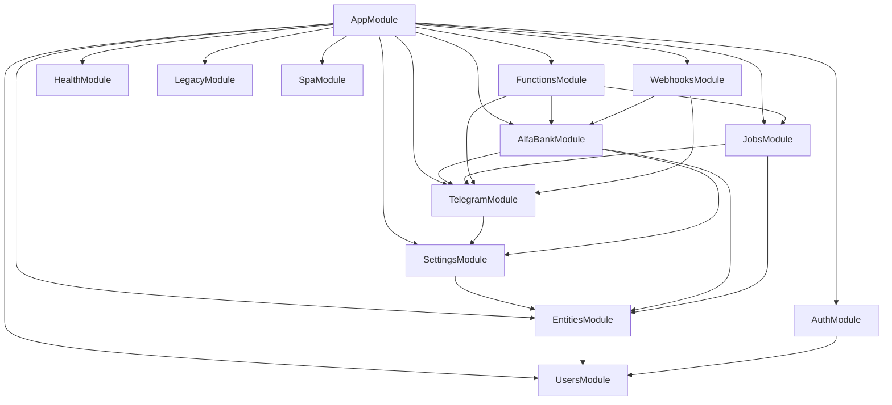

# LonghuaCRM — План рефакторинга на NestJS + PostgreSQL + TypeORM

**Дата аудита:** 2025-06-27  
**Версия документа:** 1.0  
**Статус:** Только анализ, код не изменялся  

---

## Содержание

1. [Резюме](#1-резюме)
2. [Текущая архитектура](#2-текущая-архитектура)
3. [Карта модулей](#3-карта-модулей)
4. [Аудит Entity (по каждой сущности)](#4-аудит-entity-по-каждой-сущности)
5. [Аудит модулей (по каждому модулю)](#5-аудит-модулей-по-каждому-модулю)
6. [Остатки JSON-архитектуры](#6-остатки-json-архитектуры)
7. [Аудит TypeORM](#7-аудит-typeorm)
8. [Аудит PostgreSQL](#8-аудит-postgresql)
9. [Цепочка API: Frontend → PostgreSQL](#9-цепочка-api-frontend--postgresql)
10. [Безопасность](#10-безопасность)
11. [Качество архитектуры](#11-качество-архитектуры)
12. [План рефакторинга по этапам](#12-план-рефакторинга-по-этапам)
13. [Финальный отчёт](#13-финальный-отчёт)

---

## 1. Резюме

### 1.1 Цель рефакторинга

Перевести LonghuaCRM с гибридной Base44/JSON-record архитектуры на чистую реляционную модель:

- Стабильные бизнес-сущности — только TypeORM Entity с реальными колонками PostgreSQL
- Запрет `json_record` и хранения бизнес-данных в `data jsonb`
- TypeORM relations с FK вместо «голых» UUID-полей
- Typed services/DTO вместо generic CRUD `/entities/:entity`

### 1.2 Общая готовность проекта

| Область | Готовность | Комментарий |
|---------|------------|-------------|
| Определение Entity-классов | ~65% | 19 классов созданы, но без relations |
| PostgreSQL schema / миграции | ~10% | Миграция всё ещё JSONB |
| Repository / data access | ~20% | `UsersRepository` OK; `EntityRepositoryService` сломан |
| DTO / валидация API | ~15% | Только Auth имеет DTO |
| TypeORM relations / FK | ~0% | Ни одного `@ManyToOne` / `@OneToMany` |
| Совместимость Frontend ↔ API | ~25% | Зависит от сломанного generic layer |
| Безопасность (базовая) | ~60% | JWT есть, но generic CRUD слабо защищён |
| **Итого** | **~25–30%** | Миграция начата, не завершена |

### 1.3 Критический вывод

Проект находится в **переходном состоянии**: Entity описаны как реляционные, но runtime-слой (`EntityRepositoryService`, миграция, часть сервисов) продолжает работать как с JSON-record (`row.data`, `data jsonb`). Это главный источник 500, пустых ответов и потери данных.

---

## 2. Текущая архитектура

### 2.1 Структура `apps/api/src`

```
apps/api/src/
├── app.module.ts          # Корневой модуль, TypeORM, все imports
├── main.ts                # Bootstrap, global pipes/filters/interceptors
├── config/
│   ├── configuration.ts   # Маппинг env → config object
│   └── env.validation.ts  # class-validator для env
├── common/
│   ├── constants/entity-names.ts
│   ├── decorators/current-user.decorator.ts
│   ├── filters/all-exceptions.filter.ts
│   ├── guards/jwt-auth.guard.ts, admin.guard.ts
│   ├── interceptors/logging.interceptor.ts
│   └── utils/record.util.ts
├── database/
│   ├── data-source.ts
│   ├── migrations/1730000000000-InitialSchema.ts
│   └── scripts/import-json.ts
├── entities/              # 19 Entity + index + crm.entities barrel
└── modules/
    ├── alfabank/
    ├── auth/
    ├── entities/          # Generic CRUD — центральная точка legacy
    ├── functions/
    ├── health/
    ├── jobs/
    ├── legacy/
    ├── settings/
    ├── spa/
    ├── telegram/
    ├── users/
    └── webhooks/
```

### 2.2 Диаграмма зависимостей модулей



**Циклических зависимостей между модулями не обнаружено.**

### 2.3 TypeORM configuration

| Параметр | Файл | Значение |
|----------|------|----------|
| `entities` | `app.module.ts:38`, `data-source.ts:9` | `ALL_ENTITIES` из `entities/index.ts` |
| `synchronize` | `app.module.ts:39` | `true` в non-production |
| `migrationsRun` | `app.module.ts:41` | `true` в production |
| `migrations` | `app.module.ts:40`, `data-source.ts:10` | `InitialSchema1730000000000` |
| `logging` | `app.module.ts:42` | `true` в development |

**Проблема:** в development `synchronize: true` может создавать реляционные колонки поверх JSON-схемы; в production `migrationsRun` создаёт JSON-схему. Поведение dev/prod **противоречиво**.

### 2.4 Регистрация Entity

`ALL_ENTITIES` (`entities/index.ts:24-42`) включает 17 сущностей + `UserEntity`:

- UserEntity, StudentEntity, TeacherEntity, LessonEntity, PaymentEntity, CourseEntity
- LessonMaterialEntity, ScheduleSlotEntity, LessonStudentEntity, LessonBalanceEntity
- TeacherPaymentEntity, MaterialAccessEntity, TeacherAvailabilityEntity
- AlfaBankOrderEntity, AppSettingEntity, ShopSettingEntity, WelcomePageSettingEntity

**Не зарегистрированы, но существуют:**
- `ShopEntity` (`Shop.entity.ts`) — экспортируется в `crm.entities.ts:6`
- `WelcomePageEntity` (`WelcomePage.entity.ts`) — экспортируется в `crm.entities.ts:7`

**Удалён в git, но упоминается ripgrep:**
- `json-record.entity.ts` — статус `D` в git (`git status`)

---

## 3. Карта модулей

| Модуль | Контроллеры | Сервисы | DTO | Entity (forFeature) | Зависимости |
|--------|-------------|---------|-----|-------------------|-------------|
| UsersModule | — | UsersRepository | — | UserEntity | — |
| EntitiesModule | EntitiesController | EntityRepositoryService | — | 16 CRM entities | UsersModule |
| AuthModule | AuthController | AuthService, JwtStrategy | LoginDto, RegisterDto, UpdateMeDto | — | UsersModule |
| SettingsModule | — | SettingsService | — | — | EntitiesModule |
| TelegramModule | — | TelegramService, TelegramWebhookLifecycleService | — | — | SettingsModule |
| AlfaBankModule | — | AlfaBankService | — | — | EntitiesModule, SettingsModule, TelegramModule |
| JobsModule | — | JobsService | — | — | EntitiesModule, TelegramModule |
| FunctionsModule | FunctionsController | — | — | — | TelegramModule, AlfaBankModule, JobsModule |
| WebhooksModule | WebhooksController | — | — | — | TelegramModule, AlfaBankModule |
| HealthModule | HealthController | — | — | — | — |
| LegacyModule | LegacyController | — | — | — | — |
| SpaModule | SpaController | — | — | — | — |

---

## 4. Аудит Entity (по каждой сущности)

### 4.1 UserEntity

| Параметр | Значение |
|----------|----------|
| **Файл** | `apps/api/src/entities/user.entity.ts` |
| **Таблица** | `users` |
| **Назначение** | Учётные записи системы (auth, роли) |

**Поля:**

| Property | Column | Type | Nullable |
|----------|--------|------|----------|
| id | id | uuid (PK) | no |
| email | email | varchar, unique index | no |
| passwordHash | password_hash | varchar | no |
| role | role | varchar, default `pending` | no |
| firstName | first_name | varchar | no |
| lastName | last_name | varchar | no |
| phone | phone | varchar | no |
| telegramId | telegram_id | varchar | no |
| createdDate | created_date | timestamptz | no |
| updatedDate | updated_date | timestamptz | no |

**Связи TypeORM:** отсутствуют (должны быть `OneToOne` → Student, Teacher).

**Использование:**

| Слой | Файл |
|------|------|
| Repository | `modules/users/users.repository.ts` |
| Service | `modules/auth/auth.service.ts` |
| Mapper | `modules/users/user.mapper.ts` → snake_case record |
| Module | `UsersModule`, `AuthModule` |
| Generic API | `EntityRepositoryService.list('User')` через `userToRecord` |

**Проблемы:**
- Нет relation к Student/Teacher по `user_id`
- `UpdateMeDto` (`auth/dto/update-me.dto.ts:20-22`) позволяет менять `role` любому аутентифицированному пользователю

**Что изменить:** добавить relations; ограничить смену роли только admin; убрать из generic entities API.

---

### 4.2 StudentEntity

| Параметр | Значение |
|----------|----------|
| **Файл** | `apps/api/src/entities/Student.entity.ts` |
| **Таблица** | `students` |
| **Назначение** | Ученики CRM |

**Поля:** `id`, `name`, `firstName`, `lastName`, `email` (unique), `phone`, `telegramId`, `assignedTeacher`, `lessonBalance`, `startDate`, `birthday`, `notes`, `status` (enum), `userId`, `createdDate`, `updatedDate`.

**Связи:** отсутствуют. Ожидаемые:
- `ManyToOne` → TeacherEntity (`assignedTeacher`)
- `OneToOne` → UserEntity (`userId`)
- `OneToMany` → LessonEntity, PaymentEntity, CourseEntity
- `OneToOne` → LessonBalanceEntity

**Использование:**

| Слой | Файл |
|------|------|
| Generic CRUD | `EntityRepositoryService`, `EntitiesController` |
| Services | `alfabank.service.ts:119-124`, `jobs.service.ts:65-86` |
| Frontend | `src/pages/Payments.jsx`, `Schedule.jsx`, `UserManagement.jsx`, и др. |

**Проблемы:**
- `lessonBalance` дублирует `LessonBalanceEntity`
- Generic layer не маппит snake_case (`lesson_balance`) → `lessonBalance`
- Nullable поля типизированы как non-null `string`

**Что изменить:** relations; единый source of truth для баланса; mapper snake_case; typed StudentService + DTO.

---

### 4.3 TeacherEntity

| Параметр | Значение |
|----------|----------|
| **Файл** | `apps/api/src/entities/Teacher.entity.ts` |
| **Таблица** | `teachers` |

**Поля:** `id`, `name`, `firstName`, `lastName`, `email` (unique), `hourlyRate` (numeric), `telegramId`, `status` (enum), `specializations`, `userId`, dates.

**Связи:** отсутствуют. Ожидаемые:
- `OneToOne` → UserEntity
- `OneToMany` → StudentEntity, LessonEntity, ScheduleSlotEntity, TeacherAvailabilityEntity

**Использование:** Generic CRUD, Jobs (reminders), Frontend dashboards.

**Проблемы:** `hourlyRate` numeric → runtime string; нет FK на User.

---

### 4.4 LessonEntity

| Параметр | Значение |
|----------|----------|
| **Файл** | `apps/api/src/entities/Lesson.entity.ts` |
| **Таблица** | `lessons` |

**Поля (ключевые):** `scheduleSlotId`, `teacherId`, `teacherName/FirstName/LastName`, `studentId`, `studentName/FirstName/LastName`, `studentIds` (simple-array), `studentNames` (simple-array), `date`, `startTime`, `duration`, `meetingLink`, `status`, `lessonFormat`, `lessonType`, `lessonTopic`, `notes`, `isRecurring`, `recurringGroupId`, `materialIds` (simple-array), `balanceDeducted`, `teacherPaymentId`, `reminder24hSent`, `reminder2hSent`.

**Связи:** отсутствуют. Ожидаемые:
- `ManyToOne` → TeacherEntity, ScheduleSlotEntity
- `OneToMany` → LessonStudentEntity
- `ManyToMany` → LessonMaterialEntity (через join table вместо `materialIds`)

**Использование:** Generic CRUD, `jobs.service.ts`, весь Schedule UI.

**Проблемы:**
- Массивное дублирование имён teacher/student при наличии ID
- `studentIds` + `LessonStudentEntity` — двойная модель групповых уроков
- `simple-array` без FK

---

### 4.5 CourseEntity

| Параметр | Значение |
|----------|----------|
| **Файл** | `apps/api/src/entities/Course.entity.ts` |
| **Таблица** | `courses` |

**Поля:** `studentId`, `studentName`, `courseType` (enum, column без `name` → `courseType`), `courseName`, `totalLessons`, `completedLessons`, `startDate`, `status`, `notes`.

**Связи:** отсутствуют. Ожидаемые: `ManyToOne` → StudentEntity; `OneToMany` → LessonMaterialEntity.

**Проблемы:** `studentName` дублирует Student; `courseType` без explicit `name: 'course_type'`.

---

### 4.6 PaymentEntity

| Параметр | Значение |
|----------|----------|
| **Файл** | `apps/api/src/entities/Payment.entity.ts` |
| **Таблица** | `payments` |

**Поля Entity:** `studentId`, `lessonId`, `courseId`, `amount`, `currency`, `status`, `provider`, `externalId`, `paidAt`, `notes`.

**Поля Frontend (ожидаемые):** `student_name`, `lessons_added`, `payment_date`, `comment`  
Источник: `src/pages/Payments.jsx:18-61`, `src/components/payments/PaymentFormDialog.jsx:72-78`.

**Поля AlfaBank service:** `lessons_added`, `package_type`, `payment_date`, `comment`, `order_number`  
Источник: `alfabank.service.ts:35-43`.

**Связи:** отсутствуют. Ожидаемые: `ManyToOne` → StudentEntity, LessonEntity, CourseEntity.

**Проблемы:** **полный разрыв контракта** между Entity и потребителями API.

**Что изменить:** определить целевую доменную модель Payment; добавить недостающие колонки или адаптировать frontend/сервисы.

---

### 4.7 LessonMaterialEntity

| Параметр | Значение |
|----------|----------|
| **Файл** | `apps/api/src/entities/LessonMaterial.entity.ts` |
| **Таблица** | `lesson_materials` |

**Поля:** `title`, `description`, `fileUrl`, `fileType` (enum), `courseId`, `blockName`, `tags` (simple-array).

**Связи:** отсутствуют. Ожидаемые: `ManyToOne` → CourseEntity.

---

### 4.8 ScheduleSlotEntity

| Параметр | Значение |
|----------|----------|
| **Файл** | `apps/api/src/entities/ScheduleSlot.entity.ts` |
| **Таблица** | `schedule_slots` |

**Поля:** `teacherId`, `date`, `startTime`, `duration`, `lessonType`, `format`, `status`, `recurringGroupId`, `meetingLink`.

**Связи:** отсутствуют. Ожидаемые: `ManyToOne` → TeacherEntity; `OneToMany` → LessonEntity.

---

### 4.9 LessonStudentEntity

| Параметр | Значение |
|----------|----------|
| **Файл** | `apps/api/src/entities/LessonStudent.entity.ts` |
| **Таблица** | `lesson_students` |

**Поля:** `lessonId`, `studentId`, `attendanceStatus` (enum), `balanceDeducted`.

**Связи:** отсутствуют. Ожидаемые: `ManyToOne` → LessonEntity, StudentEntity. Unique constraint `(lesson_id, student_id)`.

**Проблемы:** дублирует `Lesson.studentIds`.

---

### 4.10 LessonBalanceEntity

| Параметр | Значение |
|----------|----------|
| **Файл** | `apps/api/src/entities/LessonBalance.entity.ts` |
| **Таблица** | `lesson_balances` |

**Поля:** `studentId` (unique index), `lessonsAvailable`, `lessonsUsed`.

**Связи:** отсутствуют. Ожидаемые: `OneToOne` → StudentEntity.

**Проблемы:** дублирует `Student.lessonBalance`; frontend использует только `lesson_balance` на Student.

---

### 4.11 TeacherPaymentEntity

| Параметр | Значение |
|----------|----------|
| **Файл** | `apps/api/src/entities/TeacherPayment.entity.ts` |
| **Таблица** | `teacher_payments` |

**Поля:** `teacherId`, `lessonId`, `amount`, `status`, `note`.

**Связи:** отсутствуют.

---

### 4.12 MaterialAccessEntity

| Параметр | Значение |
|----------|----------|
| **Файл** | `apps/api/src/entities/MaterialAccess.entity.ts` |
| **Таблица** | `material_access` |

**Поля Entity:** `userId`, `materialId`, `grantedByRole` (enum ADMIN/TEACHER), `access` (boolean), `notes`.

**Поля Frontend (часть UI):** `student_ids`, `access_type`, `granted_by`, `granted_date`  
Источник: `src/components/materials/BulkAccessModal.jsx:66-98`.

**Связи:** отсутствуют. Ожидаемые: `ManyToOne` → UserEntity, LessonMaterialEntity.

**Проблемы:** BulkAccessModal использует другую модель доступа, чем Entity.

---

### 4.13 TeacherAvailabilityEntity

| Параметр | Значение |
|----------|----------|
| **Файл** | `apps/api/src/entities/TeacherAvailability.entity.ts` |
| **Таблица Entity** | `teacher_availability` (строка 10) |
| **Таблица migration/constants** | `teacher_availabilities` (`entity-names.ts:39`, migration `:36`) |

**Поля:** `teacherId`, `slots` (jsonb array).

**Связи:** отсутствуют.

**Проблемы:**
- Несовпадение имени таблицы
- JSONB для slots — нарушение правила «no JSON for stable business entities»
- Frontend ожидает `slots` как массив — совместимо по форме, но не по storage policy

---

### 4.14 AlfaBankOrderEntity

| Параметр | Значение |
|----------|----------|
| **Файл** | `apps/api/src/entities/alfaBankOrder.entity.ts` |
| **Таблица** | `alfa_bank_orders` |

**Поля:** `studentId`, `orderNumber` (unique), `alfaOrderId` (unique), `type`, `itemId`, `amount`, `status`, `paymentDate`, `notes`.

**Связи:** отсутствуют.

**Проблемы:** `AlfaBankService` не использует эту Entity — пишет в `Payment` со старыми полями.

---

### 4.15 AppSettingEntity

| Параметр | Значение |
|----------|----------|
| **Файл** | `apps/api/src/entities/AppSetting.entity.ts` |
| **Таблица** | `app_settings` |
| **API name** | `AppSettings` |

**Поля:** `key`, `value`, `description`, `type`, `isActive` (column без `name` → camelCase в БД при synchronize).

**Использование:** `settings.service.ts:16-22`, `TelegramSettings.jsx`.

**Проблемы:** key/value модель OK для settings, но `isActive` без snake_case name.

---

### 4.16 ShopSettingEntity (активная)

| Параметр | Значение |
|----------|----------|
| **Файл** | `apps/api/src/entities/ShopSetting.entity.ts` |
| **Таблица** | `shop_settings` |
| **API name** | `ShopSettings` |

**Поля Entity:** `key`, `value`, `description`, `type`, `isActive`.

**Поля Frontend:** `item_id`, `label`, `lessons`, `price`, `note`, `type`, `sort_order`, `is_active`, `description`  
Источник: `src/pages/ShopSettingsAdmin.jsx:5-18`.

**Проблемы:** Entity — key/value store; Frontend — каталог товаров. **Полный разрыв модели.**

---

### 4.17 ShopEntity (неактивная / мёртвая)

| Параметр | Значение |
|----------|----------|
| **Файл** | `apps/api/src/entities/Shop.entity.ts` |
| **Таблица** | `shop_settings` (конфликт с ShopSettingEntity) |
| **В ALL_ENTITIES** | Нет |

**Поля:** `name`, `type`, `description`, `price`, `lessonsCount`, `imageUrl`, `currency`, `isActive`.

**Проблемы:** ближе к frontend-модели, но не зарегистрирована; конфликт table name; нет `item_id`, `label`, `sort_order`.

**Рекомендация:** заменить `ShopSettingEntity` на полноценную `ShopItemEntity` с таблицей `shop_items`.

---

### 4.18 WelcomePageSettingEntity (активная)

| Параметр | Значение |
|----------|----------|
| **Файл** | `apps/api/src/entities/WelcomePageSetting.entity.ts` |
| **Таблица** | `welcome_page_settings` |

**Поля Entity:** key/value model.

**Поля Frontend:** `school_name`, `title`, `subtitle`, `body_text`, `info_text`  
Источник: `src/pages/WelcomePageEditor.jsx:7-12`.

**Проблемы:** разрыв модели; публичное чтение (`PUBLIC_READ_ENTITIES`) отдаёт key/value, а не контент страницы.

---

### 4.19 WelcomePageEntity (неактивная / мёртвая)

| Параметр | Значение |
|----------|----------|
| **Файл** | `apps/api/src/entities/WelcomePage.entity.ts` |
| **Таблица** | `welcome_page_settings` (конфликт) |
| **В ALL_ENTITIES** | Нет |

**Поля:** `title`, `subtitle`, `description`, `heroImageUrl`, `videoUrl`, `isActive`.

**Проблемы:** ближе к UI, но нет `school_name`, `body_text`, `info_text`; конфликт table name.

---

### 4.20 JsonRecordEntity (удалён)

| Параметр | Значение |
|----------|----------|
| **Файл** | `apps/api/src/entities/json-record.entity.ts` |
| **Git status** | `D` (deleted, не закоммичено) |
| **Содержимое в HEAD** | abstract class с `data: Record<string, unknown>` jsonb |

Импортов в текущем `src` не найдено. Поведение JSON-record сохранено в `EntityRepositoryService`.

---

## 5. Аудит модулей (по каждому модулю)

### 5.1 EntitiesModule

| Параметр | Значение |
|----------|----------|
| **Назначение** | Generic CRUD API `/api/entities/:entity` |
| **Файлы** | `entities.module.ts`, `entities.controller.ts`, `entity-repository.service.ts` |
| **Сервисы** | EntityRepositoryService |
| **Контроллеры** | EntitiesController |
| **DTO** | Нет (только `Record<string, unknown>`) |
| **Entity** | 16 CRM entities via `TypeOrmModule.forFeature` |
| **Repository** | EntityRepositoryService (God Object) |
| **Зависимости** | UsersModule |

**Проблемные места:**
- `entity-repository.service.ts:102-107` — читает `r.data`
- `entity-repository.service.ts:168-175` — пишет `data: input`
- `entity-repository.service.ts:132-136` — filter в памяти, без `$contains` (хотя `record.util.ts:27-37` его поддерживает, но не используется)
- `entities.controller.ts:33-58` — любой auth user может CRUD любую сущность
- Нет role-based access per entity

**Рекомендации:** заменить на typed modules (StudentsModule, LessonsModule, …) или временный compatibility mapper; затем удалить generic controller.

---

### 5.2 AuthModule

| Параметр | Значение |
|----------|----------|
| **Назначение** | JWT auth, register/login/me |
| **Сервисы** | AuthService, JwtStrategy |
| **Контроллеры** | AuthController |
| **DTO** | LoginDto, RegisterDto (re-export), UpdateMeDto |
| **Entity** | — (через UsersRepository) |
| **Зависимости** | UsersModule |

**Проблемы:**
- `UpdateMeDto.role` (`update-me.dto.ts:20-22`) — privilege escalation
- `register.dto.ts` — re-export из `login.dto.ts` (нестандартно, но работает)

**Рекомендации:** AdminGuard для смены роли; отдельный AdminUpdateUserDto.

---

### 5.3 UsersModule

| Параметр | Значение |
|----------|----------|
| **Назначение** | Persistence users |
| **Сервисы** | UsersRepository (implements OnModuleInit seed) |
| **Entity** | UserEntity |
| **Зависимости** | — |

**Состояние:** единственный корректно реализованный typed repository.

---

### 5.4 SettingsModule

| Параметр | Значение |
|----------|----------|
| **Назначение** | Чтение credentials из env + AppSettings |
| **Сервисы** | SettingsService |
| **Зависимости** | EntitiesModule |

**Проблемы:** зависит от сломанного EntityRepositoryService.filter.

---

### 5.5 AlfaBankModule

| Параметр | Значение |
|----------|----------|
| **Назначение** | Инициализация платежей, webhook |
| **Сервисы** | AlfaBankService |
| **Зависимости** | EntitiesModule, SettingsModule, TelegramModule |

**Проблемы:**
- `alfabank.service.ts:30` — filter ShopSettings по `item_id` (поля нет в Entity)
- `alfabank.service.ts:35-43` — create Payment со старыми полями
- `alfabank.service.ts:105-107` — filter с `$contains`, не поддерживается EntityRepositoryService
- Не использует AlfaBankOrderEntity

---

### 5.6 JobsModule

| Параметр | Значение |
|----------|----------|
| **Назначение** | Cron: reminders, auto-complete, backup, revoke access |
| **Сервисы** | JobsService |
| **Зависимости** | EntitiesModule, TelegramModule |

**Проблемы:**
- Все операции через сломанный EntityRepositoryService
- `autoCompleteExpiredLessons`, `sendLessonReminders*` доступны через FunctionsController **без auth** (`functions.controller.ts:55`)

---

### 5.7 FunctionsModule

| Параметр | Значение |
|----------|----------|
| **Назначение** | Legacy Base44-compatible `/api/functions/:name` |
| **Контроллеры** | FunctionsController |
| **Зависимости** | TelegramModule, AlfaBankModule, JobsModule |

**Проблемы:**
- `AdminGuard` импортирован (`functions.controller.ts:15`), но **не используется** — проверка admin inline
- Cron-job functions callable without authentication
- `tgDebug` — публичная функция

---

### 5.8 WebhooksModule

| Параметр | Значение |
|----------|----------|
| **Назначение** | Telegram + AlfaBank webhooks |
| **Контроллеры** | WebhooksController |
| **Зависимости** | TelegramModule, AlfaBankModule |

**Безопасность:**
- Telegram: secret token check (`webhooks.controller.ts:31-34`) — OK если настроен
- AlfaBank: без auth (ожидаемо для bank callback), MD5 checksum в service

---

### 5.9 TelegramModule

| Параметр | Значение |
|----------|----------|
| **Назначение** | Bot API, webhook lifecycle |
| **Сервисы** | TelegramService, TelegramWebhookLifecycleService |
| **Зависимости** | SettingsModule |

**Состояние:** относительно изолирован, не зависит от EntityRepositoryService напрямую.

---

### 5.10 LegacyModule

| Параметр | Значение |
|----------|----------|
| **Назначение** | Base44 public-settings compatibility |
| **Файл** | `legacy.controller.ts:3-8` |
| **Route** | `GET /api/apps/public/prod/public-settings/by-id/longhua-crm` |

**Рекомендация:** сохранить до миграции frontend; удалить после.

---

### 5.11 HealthModule / SpaModule

- **Health:** `GET /api/health` — публичный, OK
- **Spa:** fallback для frontend routes — OK

---

## 6. Остатки JSON-архитектуры

| # | Файл | Строки | Проблема | Почему критично | Как исправить |
|---|------|--------|----------|-----------------|---------------|
| 1 | `database/migrations/1730000000000-InitialSchema.ts` | 24-53 | Таблицы `id + data jsonb` | Production schema ≠ Entity | Новая relational migration |
| 2 | `database/migrations/1730000000000-InitialSchema.ts` | 55-70 | Индексы `data->>'...'` | Индексы бесполезны для relational columns | Relational indexes на реальных колонках |
| 3 | `modules/entities/entity-repository.service.ts` | 102-107, 150-155 | `...r.data` | list/get возвращают пустые records | Entity-to-record mapper |
| 4 | `modules/entities/entity-repository.service.ts` | 168-175 | `data: input` | create пишет несуществующую колонку | Map input → entity fields |
| 5 | `modules/entities/entity-repository.service.ts` | 184-187 | `row.data = ...` | update не работает | Partial update entity fields |
| 6 | `modules/entities/entities.controller.ts` | 33-107 | Generic CRUD без DTO | Нет типизации, нет field validation | Typed controllers |
| 7 | `common/utils/record.util.ts` | 5-51 | Record abstraction | Legacy terminology; `matchesFilter`/`sortRecords` не используются в repository | Удалить или использовать в mapper |
| 8 | `database/scripts/import-json.ts` | 49-132 | Import из `database.json` | Старый формат records | Per-entity migrator |
| 9 | `entities/json-record.entity.ts` | — | Удалён в git, не закоммичен | Технический долг | Финализировать удаление |
| 10 | `entities/TeacherAvailability.entity.ts` | 26-31 | `slots` jsonb | Нарушение no-JSON policy | `TeacherAvailabilitySlotEntity` |
| 11 | `base44/entities/*.jsonc` | — | Legacy schema reference | Не runtime, но путает | Архивировать / удалить |
| 12 | `base44/functions/*.ts` | — | Legacy serverless functions | Дублируют NestJS logic | Удалить после миграции |

---

## 7. Аудит TypeORM

### 7.1 Используемые декораторы

| Декоратор | Найден | Комментарий |
|-----------|--------|-------------|
| `@Entity` | Да, все Entity | OK |
| `@Column` | Да | Частично без `name` для camelCase |
| `@PrimaryGeneratedColumn` | Да (кроме User — `@PrimaryColumn`) | OK |
| `@CreateDateColumn` / `@UpdateDateColumn` | Да | snake_case names OK |
| `@Index` | Student, Teacher, Lesson, Payment, etc. | OK |
| `@ManyToOne` | **Нет** | Критично |
| `@OneToMany` | **Нет** | Критично |
| `@OneToOne` | **Нет** | Критично |
| `@ManyToMany` | **Нет** | Критично |
| `@JoinColumn` | **Нет** | — |
| `@JoinTable` | **Нет** | — |
| `cascade` | **Нет** | Нужно определить per-relation |
| `eager` / `lazy` | **Нет** | OK (default lazy) |

### 7.2 Отсутствующие связи (полный список)

| From | To | Type | FK column |
|------|-----|------|-----------|
| StudentEntity | TeacherEntity | ManyToOne | assigned_teacher |
| StudentEntity | UserEntity | OneToOne | user_id |
| TeacherEntity | UserEntity | OneToOne | user_id |
| CourseEntity | StudentEntity | ManyToOne | student_id |
| LessonEntity | TeacherEntity | ManyToOne | teacher_id |
| LessonEntity | StudentEntity | ManyToOne | student_id |
| LessonEntity | ScheduleSlotEntity | ManyToOne | schedule_slot_id |
| LessonStudentEntity | LessonEntity | ManyToOne | lesson_id |
| LessonStudentEntity | StudentEntity | ManyToOne | student_id |
| LessonBalanceEntity | StudentEntity | OneToOne | student_id |
| LessonMaterialEntity | CourseEntity | ManyToOne | course_id |
| PaymentEntity | StudentEntity | ManyToOne | student_id |
| PaymentEntity | LessonEntity | ManyToOne | lesson_id |
| PaymentEntity | CourseEntity | ManyToOne | course_id |
| TeacherPaymentEntity | TeacherEntity | ManyToOne | teacher_id |
| TeacherPaymentEntity | LessonEntity | ManyToOne | lesson_id |
| MaterialAccessEntity | UserEntity | ManyToOne | user_id |
| MaterialAccessEntity | LessonMaterialEntity | ManyToOne | material_id |
| TeacherAvailabilityEntity | TeacherEntity | ManyToOne | teacher_id |
| AlfaBankOrderEntity | StudentEntity | ManyToOne | student_id |
| ScheduleSlotEntity | TeacherEntity | ManyToOne | teacher_id |
| LessonEntity | TeacherPaymentEntity | ManyToOne | teacher_payment_id |

### 7.3 Специальные типы колонок

| Entity | Column | Type | Проблема |
|--------|--------|------|----------|
| LessonEntity | studentIds, studentNames, materialIds | simple-array | Нет FK, comma issues |
| LessonMaterialEntity | tags | simple-array | OK для tags, но лучше normalized |
| TeacherAvailabilityEntity | slots | jsonb | Policy violation |
| PaymentEntity, TeacherPaymentEntity, etc. | amount | numeric | Runtime string, typed as number |

---

## 8. Аудит PostgreSQL

### 8.1 Entity vs Migration

| Таблица | Migration schema | Entity schema | Статус |
|---------|------------------|---------------|--------|
| users | Relational columns | Relational | OK |
| students | `id, data jsonb` | 15+ columns | **MISMATCH** |
| teachers | `id, data jsonb` | 10+ columns | **MISMATCH** |
| lessons | `id, data jsonb` | 25+ columns | **MISMATCH** |
| payments | `id, data jsonb` | 10+ columns | **MISMATCH** |
| courses | `id, data jsonb` | 9+ columns | **MISMATCH** |
| lesson_materials | `id, data jsonb` | 8+ columns | **MISMATCH** |
| schedule_slots | `id, data jsonb` | 9+ columns | **MISMATCH** |
| lesson_students | `id, data jsonb` | 5+ columns | **MISMATCH** |
| lesson_balances | `id, data jsonb` | 4+ columns | **MISMATCH** |
| teacher_payments | `id, data jsonb` | 6+ columns | **MISMATCH** |
| material_access | `id, data jsonb` | 6+ columns | **MISMATCH** |
| teacher_availabilities (migration) | `id, data jsonb` | Entity: `teacher_availability` | **MISMATCH + NAME** |
| alfa_bank_orders | `id, data jsonb` | 9+ columns | **MISMATCH** |
| app_settings | `id, data jsonb` | key/value columns | **MISMATCH** |
| shop_settings | `id, data jsonb` | key/value OR shop item | **MISMATCH** |
| welcome_page_settings | `id, data jsonb` | key/value OR page content | **MISMATCH** |

### 8.2 Несовпадения имён таблиц

| Entity | `@Entity()` name | ENTITY_TABLE_MAP / Migration |
|--------|------------------|------------------------------|
| TeacherAvailabilityEntity | `teacher_availability` | `teacher_availabilities` |

### 8.3 snake_case vs camelCase

Колонки **с explicit `name`** — snake_case (большинство FK и дат).

Колонки **без `name`** (TypeORM default camelCase при synchronize):

| Entity | Property | Likely DB column (dev synchronize) |
|--------|----------|-------------------------------------|
| CourseEntity | courseType | courseType |
| CourseEntity | courseName | courseName |
| CourseEntity | totalLessons | totalLessons |
| ShopEntity | lessonsCount | lessonsCount |
| ShopEntity | isActive | isActive |
| WelcomePageEntity | heroImageUrl | heroImageUrl |
| AppSettingEntity | isActive | isActive |
| ShopSettingEntity | isActive | isActive |
| WelcomePageSettingEntity | isActive | isActive |

Frontend и сервисы ожидают **snake_case** (`lesson_balance`, `start_time`, `course_type`).

### 8.4 dev vs prod расхождение

| Режим | Schema source | Результат |
|-------|---------------|-----------|
| development | `synchronize: true` | TypeORM создаёт relational columns |
| production | `migrationsRun: true` | Migration создаёт JSON tables |

**Это критическая операционная проблема.**

---

## 9. Цепочка API: Frontend → PostgreSQL

### 9.1 Текущий поток (сломанный)

```
Frontend (snake_case JSON)
  → base44Client.js POST/PATCH /api/entities/:entity
    → EntitiesController (no DTO)
      → EntityRepositoryService (expects row.data)
        → TypeORM Repository
          → PostgreSQL (jsonb OR relational — depends on env)
```

### 9.2 Целевой поток

```
Frontend (snake_case JSON)
  → Typed Controller
    → DTO (class-validator, snake_case ↔ camelCase transform)
      → Domain Service
        → Typed Repository
          → TypeORM Entity (relations)
            → PostgreSQL (FK, constraints)
```

### 9.3 Разрывы цепочки (подтверждённые)

| Entity | Frontend fields | Entity fields | Разрыв |
|--------|-----------------|---------------|--------|
| Payment | student_name, lessons_added, payment_date, comment | studentId, amount, paidAt, notes | **Полный** |
| ShopSettings | item_id, label, lessons, price, sort_order | key, value | **Полный** |
| WelcomePageSettings | school_name, body_text, info_text | key, value | **Полный** |
| Student | lesson_balance | lessonBalance | Имя поля (mapper) |
| Lesson | start_time, teacher_id, student_ids | startTime, teacherId, studentIds | Имя поля (mapper) |
| MaterialAccess | student_ids (BulkAccessModal) | userId, access | **Модель** |
| AlfaBank | lessons_added, package_type, comment | — | Payment Entity не содержит |
| All entities | created_date | createdDate | Mapper возвращает createdDate, не created_date |

### 9.4 Auth chain (работает)

```
Frontend → /api/auth/login → LoginDto → AuthService → UsersRepository → UserEntity
         → userToRecord (snake_case) → JWT
```

Единственная полностью рабочая typed цепочка.

---

## 10. Безопасность

### 10.1 JWT

| Компонент | Файл | Статус |
|-----------|------|--------|
| Strategy | `jwt.strategy.ts` | Bearer + x-access-token |
| Guard | `jwt-auth.guard.ts` | Required + Optional variants |
| Secret | `configuration.ts:7-11` | Dev fallback; prod requires JWT_SECRET |
| Expiry | `configuration.ts:12` | Default 7d |

### 10.2 Guards и роли

| Route | Guard | Проблема |
|-------|-------|----------|
| `GET /entities/:entity` | OptionalJwtAuthGuard | Только WelcomePageSettings публичен |
| `POST/PATCH/DELETE /entities/*` | JwtAuthGuard | **Любой auth user = полный CRUD всех entities** |
| `POST /functions/:name` (cron jobs) | OptionalJwtAuthGuard | **Без auth** для autoComplete, reminders |
| `POST /functions/:name` (admin) | Inline role check | AdminGuard импортирован, не используется |
| `PATCH /auth/me` | JwtAuthGuard | Можно менять role (`update-me.dto.ts:20-22`) |
| `POST /webhooks/telegram` | Secret header | OK if configured |
| `POST /webhooks/alfabank` | Checksum in service | OK |
| `GET /health` | None | OK |
| `GET /legacy/*` | None | OK (static config) |

### 10.3 Рекомендации по безопасности

1. Role-based guards per entity/operation (admin, teacher, student)
2. Убрать `role` из `UpdateMeDto` для non-admin
3. Защитить cron-trigger functions (admin only или internal secret)
4. Rate limiting на auth endpoints
5. Не возвращать stack traces (AllExceptionsFilter OK — скрывает details)

---

## 11. Качество архитектуры

### 11.1 God Objects

| Объект | Файл | Проблема |
|--------|------|----------|
| EntityRepositoryService | `entity-repository.service.ts` | 16 repositories, generic CRUD, mapping, filter, sort |
| EntitiesController | `entities.controller.ts` | Universal endpoint для всех сущностей |

### 11.2 Дублирование

- `Student.lessonBalance` vs `LessonBalanceEntity`
- `Lesson.studentIds` vs `LessonStudentEntity`
- Denormalized names in Lesson, Course
- `ShopEntity` vs `ShopSettingEntity` vs frontend ShopSettings
- `WelcomePageEntity` vs `WelcomePageSettingEntity`
- `record.util.ts` filter/sort vs inline filter in EntityRepositoryService
- `base44/functions/*` vs NestJS services

### 11.3 Мёртвый / неиспользуемый код

| Файл | Статус |
|------|--------|
| `ShopEntity` | Не в ALL_ENTITIES |
| `WelcomePageEntity` | Не в ALL_ENTITIES |
| `json-record.entity.ts` | Удалён, не закоммичен |
| `record.util.ts` → `matchesFilter`, `sortRecords` | Не используются в repository |
| `AdminGuard` в FunctionsController | Импорт без использования |
| `AlfaBankOrderEntity` | Не используется AlfaBankService |

### 11.4 SOLID нарушения

- **SRP:** EntityRepositoryService делает всё
- **OCP:** Новая Entity = изменения в 4+ файлах (entity-names, ENTITY_CLASS_MAP, repoMap, module forFeature)
- **DIP:** AlfaBankService, JobsService зависят от конкретного God Service

### 11.5 Технический долг

- Generic `/entities/:entity` API (Base44 compatibility layer)
- `synchronize` в dev / migrations в prod
- Import script для JSON
- Legacy module + base44 folder

---

## 12. План рефакторинга по этапам

### Этап 0: Подготовка (блокер для всего)

| Параметр | Значение |
|----------|----------|
| **Цель** | Зафиксировать текущее состояние, freeze schema decisions |
| **Файлы** | `docs/refactor-plan.md`, ADR для Payment/Shop/WelcomePage models |
| **Порядок** | 1) Утвердить доменные модели 2) Утвердить balance strategy 3) Утвердить shop model |
| **Риски** | Низкие |
| **Зависимости** | Нет |
| **Результат** | Утверждённые контракты API |
| **Критерии** | Документ согласован |
| **Трудоёмкость** | 4–8 ч |

---

### Этап 1: Реляционная миграция PostgreSQL

| Параметр | Значение |
|----------|----------|
| **Цель** | Заменить JSONB schema на relational |
| **Файлы** | `database/migrations/1730000000000-InitialSchema.ts` (replace), новая migration data transfer |
| **Порядок** | 1) Создать `1730000000001-RelationalSchema.ts` 2) Data migration `data` → columns 3) Drop `data` column 4) Add FK/indexes 5) Fix `teacher_availability` table name |
| **Риски** | **Высокие** — потеря данных при ошибке |
| **Зависимости** | Этап 0 (модели) |
| **Результат** | Production schema = Entity definitions |
| **Критерии** | `migration:run` на чистой БД создаёт корректные таблицы; existing data migrated |
| **Трудоёмкость** | 16–24 ч |

---

### Этап 2: Entity Mapper + исправление EntityRepositoryService

| Параметр | Значение |
|----------|----------|
| **Цель** | Сделать generic layer временно рабочим |
| **Файлы** | `entity-repository.service.ts`, новый `common/mappers/*.ts`, `record.util.ts` |
| **Порядок** | 1) Per-entity toRecord/fromRecord mappers 2) snake_case ↔ camelCase 3) Убрать `row.data` 4) Подключить `matchesFilter` для `$contains` 5) Fix created_date output |
| **Риски** | Средние |
| **Зависимости** | Этап 1 |
| **Результат** | Frontend снова работает через `/entities/*` |
| **Критерии** | CRUD Student/Lesson/Payment возвращает ожидаемые поля; `npm run build` OK |
| **Трудоёмкость** | 20–32 ч |

---

### Этап 3: Исправление доменных Entity (Payment, Shop, WelcomePage)

| Параметр | Значение |
|----------|----------|
| **Цель** | Привести Entity к frontend-контракту |
| **Файлы** | `Payment.entity.ts`, новый `ShopItem.entity.ts`, `WelcomePage.entity.ts`, удалить дубли, `index.ts`, `crm.entities.ts`, `entity-names.ts` |
| **Порядок** | 1) Payment: add lessonsAdded, paymentDate, comment, studentName, orderNumber 2) Shop: `shop_items` table 3) Welcome: single-row content entity 4) Update migration 5) Update mappers |
| **Риски** | Средние |
| **Зависимости** | Этап 1, 2 |
| **Результат** | Payments, Shop, Welcome pages работают |
| **Критерии** | ShopSettingsAdmin seed/create OK; Payments CRUD OK; WelcomePageEditor OK |
| **Трудоёмкость** | 12–20 ч |

---

### Этап 4: TypeORM Relations + FK

| Параметр | Значение |
|----------|----------|
| **Цель** | Добавить relations, FK, onDelete policies |
| **Файлы** | Все `*.entity.ts`, migration для FK |
| **Порядок** | 1) Core: User-Student-Teacher 2) Lesson-LessonStudent 3) Course-Material 4) Payment relations 5) Убрать simple-array studentIds где возможно |
| **Риски** | Средние — orphan data |
| **Зависимости** | Этап 1 |
| **Результат** | Referential integrity |
| **Критерии** | TypeORM metadata без warnings; FK в PostgreSQL |
| **Трудоёмкость** | 24–40 ч |

---

### Этап 5: Typed Services (замена God Service)

| Параметр | Значение |
|----------|----------|
| **Цель** | Domain services per aggregate |
| **Файлы** | Новые `modules/students/`, `modules/lessons/`, etc.; refactor `alfabank.service.ts`, `jobs.service.ts` |
| **Порядок** | 1) StudentsService 2) LessonsService 3) PaymentsService 4) MaterialsService 5) Переключить Jobs/AlfaBank |
| **Риски** | Средние |
| **Зависимости** | Этап 2–4 |
| **Результат** | Бизнес-логика в typed services |
| **Критерии** | Jobs/AlfaBank не используют EntityRepositoryService |
| **Трудоёмкость** | 32–48 ч |

---

### Этап 6: Typed Controllers + DTO

| Параметр | Значение |
|----------|----------|
| **Цель** | Заменить generic `/entities/:entity` |
| **Файлы** | Новые controllers, DTOs; deprecate `EntitiesController` |
| **Порядок** | 1) Parallel routes `/api/v2/students` etc. 2) Migrate frontend 3) Remove generic controller |
| **Риски** | Высокие — breaking API |
| **Зависимости** | Этап 5 |
| **Результат** | Clean REST API |
| **Критерии** | Frontend на typed endpoints; generic removed |
| **Трудоёмкость** | 40–60 ч |

---

### Этап 7: Безопасность и RBAC

| Параметр | Значение |
|----------|----------|
| **Цель** | Role-based access |
| **Файлы** | guards, controllers, `update-me.dto.ts` |
| **Порядок** | 1) RolesGuard 2) Per-resource permissions 3) Fix UpdateMe 4) Protect cron functions |
| **Риски** | Низкие |
| **Зависимости** | Этап 6 |
| **Результат** | Secure multi-role CRM |
| **Критерии** | Teacher не может CRUD чужих students; student read-only |
| **Трудоёмкость** | 16–24 ч |

---

### Этап 8: Cleanup legacy

| Параметр | Значение |
|----------|----------|
| **Цель** | Удалить JSON/legacy артефакты |
| **Файлы** | `EntityRepositoryService`, `record.util.ts`, `import-json.ts`, `LegacyModule`, `base44/`, finalize `json-record.entity.ts` deletion |
| **Порядок** | 1) Verify no imports 2) Delete 3) Update README |
| **Риски** | Низкие |
| **Зависимости** | Этап 6 |
| **Результат** | Чистая кодовая база |
| **Критерии** | grep `json_record`, `row.data`, `data jsonb` = 0 в src |
| **Трудоёмкость** | 8–12 ч |

---

### Этап 9: TeacherAvailability slots + balance unification

| Параметр | Значение |
|----------|----------|
| **Цель** | Убрать JSONB slots; единый баланс |
| **Файлы** | `TeacherAvailability.entity.ts`, новый slot entity, `Student.entity.ts`, `LessonBalance.entity.ts` |
| **Порядок** | 1) Slot entity 2) Migrate slots data 3) Choose balance source 4) Sync logic in services |
| **Риски** | Средние |
| **Зависимости** | Этап 4, 5 |
| **Результат** | No JSON for business data |
| **Критерии** | Availability CRUD через relational slots |
| **Трудоёмкость** | 12–16 ч |

---

## 13. Финальный отчёт

### 13.1 Общая готовность: **~25–30%**

### 13.2 Критические ошибки

1. `EntityRepositoryService` использует `row.data` при relational Entity
2. Migration создаёт JSONB tables, Entity ожидают columns
3. dev `synchronize` vs prod `migrationsRun` — разные схемы
4. Payment / ShopSettings / WelcomePageSettings — полный разрыв Entity ↔ Frontend
5. Нет TypeORM relations и FK

### 13.3 Архитектурные проблемы

1. Generic CRUD God Service вместо domain modules
2. Дублирование Entity (Shop, WelcomePage)
3. Дублирование данных (balance, student names, lesson students)
4. Legacy Base44 compatibility layer
5. simple-array и jsonb вместо relational modeling

### 13.4 Средние проблемы

1. snake_case / camelCase inconsistency
2. numeric columns typed as number
3. Nullable columns typed as non-null
4. AdminGuard не используется
5. AlfaBankOrderEntity не используется
6. Cron functions без auth

### 13.5 Мелкие проблемы

1. `register.dto.ts` re-export из login.dto
2. Dead code в record.util.ts
3. base44/ folder в repo
4. json-record.entity.ts не закоммичен как удаление

### 13.6 Рекомендуемый порядок исправления

```
Этап 0 → 1 → 2 → 3 → 4 → 5 → 6 → 7 → 8 → 9
```

**Минимальный path to working app:** Этапы 0 → 1 → 2 → 3 (без полного typed API).

**Path to clean architecture:** все этапы 0–9.

### 13.7 Оценка трудоёмкости

| Этап | Часы |
|------|------|
| 0. Подготовка | 4–8 |
| 1. Relational migration | 16–24 |
| 2. Entity mapper | 20–32 |
| 3. Domain Entity fix | 12–20 |
| 4. Relations + FK | 24–40 |
| 5. Typed services | 32–48 |
| 6. Typed controllers + DTO | 40–60 |
| 7. Security / RBAC | 16–24 |
| 8. Legacy cleanup | 8–12 |
| 9. Slots + balance | 12–16 |
| **Итого** | **184–284 ч** (~5–7 недель при 1 разработчике) |

### 13.8 Definition of Done (весь рефакторинг)

- [ ] Нет `json_record`, `row.data`, `data jsonb` в business tables
- [ ] Все Entity в `ALL_ENTITIES` без table name conflicts
- [ ] Migration = Entity schema в dev и prod
- [ ] TypeORM relations с FK для всех бизнес-связей
- [ ] Typed services + DTO для всех aggregates
- [ ] Frontend работает без generic `/entities/:entity`
- [ ] RBAC: admin / teacher / student
- [ ] `npm run build` проходит без ошибок
- [ ] Integration tests для CRUD основных сущностей

---

## Приложение A: Файлы для первоочередного изменения

```
apps/api/src/database/migrations/1730000000000-InitialSchema.ts
apps/api/src/modules/entities/entity-repository.service.ts
apps/api/src/entities/index.ts
apps/api/src/entities/Payment.entity.ts
apps/api/src/entities/Shop.entity.ts
apps/api/src/entities/ShopSetting.entity.ts
apps/api/src/entities/WelcomePage.entity.ts
apps/api/src/entities/WelcomePageSetting.entity.ts
apps/api/src/entities/TeacherAvailability.entity.ts
apps/api/src/common/constants/entity-names.ts
apps/api/src/modules/alfabank/alfabank.service.ts
apps/api/src/modules/jobs/jobs.service.ts
apps/api/src/app.module.ts
```

## Приложение B: Команды проверки после каждого этапа

```bash
npm run build --prefix apps/api
npm run migration:run --prefix apps/api
# manual: CRUD через API для Student, Lesson, Payment
# manual: ShopSettingsAdmin, Payments, WelcomePageEditor
```

---

*Документ подготовлен на основе статического анализа кодовой базы `apps/api/src` и frontend `src/` без запуска приложения и без изменения исходного кода.*
