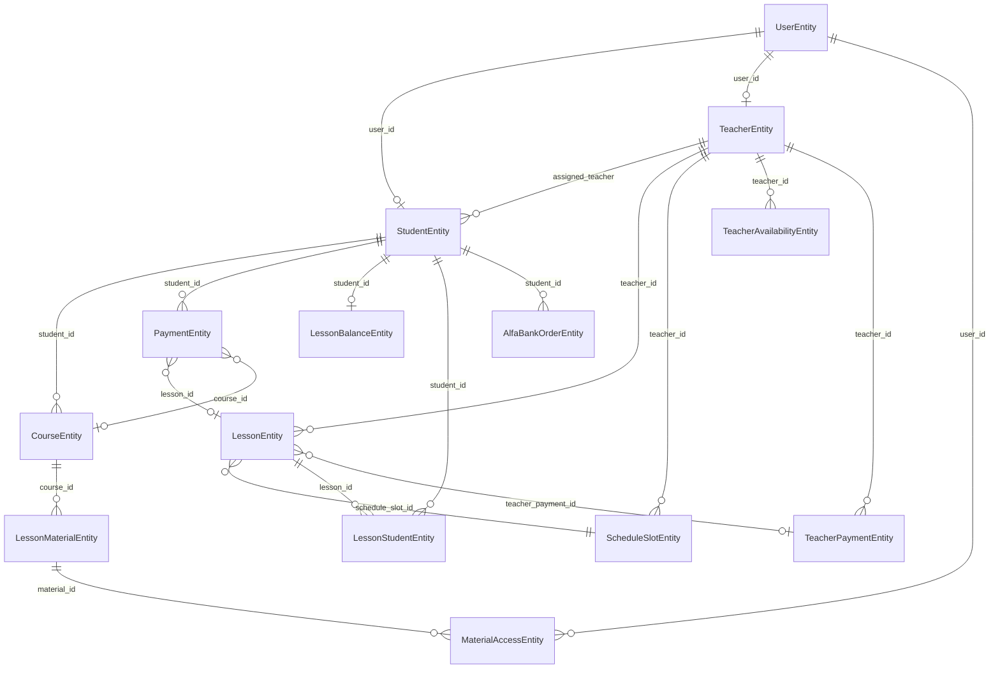
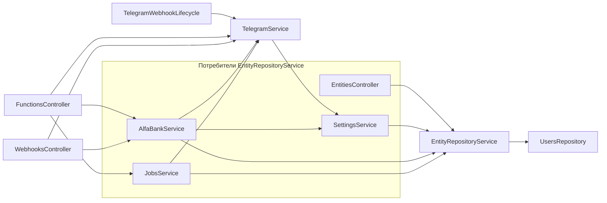

> **HISTORICAL / COMPLETED (JSONB migration finished).**
> This file describes an earlier plan/audit that mentioned `data jsonb`, `slots jsonb`, or legacy JSON storage.
> **Current architecture:** relational CRM entities; TeacherAvailability via `teacher_availability_slots`; Assessment via snapshot tables; **no JSONB for business entities**.
> See [docs/Database.md](docs/Database.md) and [docs/architecture/storage-policy.md](docs/architecture/storage-policy.md).

# LonghuaCRM — Дорожная карта рефакторинга

**Версия:** 1.0  
**Дата:** 2025-06-27  
**Основа:** [refactor-plan.md](./refactor-plan.md)  
**Статус:** Документация. Код не изменялся.

---

## Навигация

### Аудит (справочник, не перечитывать целиком)

| Документ | Содержание |
|----------|------------|
| [audit/entities.md](./audit/entities.md) | Все Entity, поля, проблемы |
| [audit/services.md](./audit/services.md) | Сервисы, зависимости, God Objects |
| [audit/api.md](./audit/api.md) | Controllers, generic CRUD, endpoints |
| [audit/frontend.md](./audit/frontend.md) | base44Client, страницы, контракты |
| [audit/database.md](./audit/database.md) | Миграции, schema, dev/prod |
| [audit/telegram.md](./audit/telegram.md) | Bot, webhooks, lifecycle |
| [audit/security.md](./audit/security.md) | JWT, guards, RBAC-дыры |

### Этапы рефакторинга (работать по одному файлу)

| # | Roadmap | **Spec (детально)** | Трудоёмкость |
|---|---------|---------------------|--------------|
| 0 | *(§Этап 0 ниже)* | — | 4–8 ч |
| 1 | [01-database.md](./roadmap/01-database.md) | **[specs/01-database-spec.md](./roadmap/specs/01-database-spec.md)** | 16–24 ч |
| 2 | [02-domain.md](./roadmap/02-domain.md) | **[specs/02-domain-spec.md](./roadmap/specs/02-domain-spec.md)** | 56–92 ч |
| 3 | [03-services.md](./roadmap/03-services.md) | **[specs/03-services-spec.md](./roadmap/specs/03-services-spec.md)** | 32–48 ч |
| 4 | [04-api.md](./roadmap/04-api.md) | **[specs/04-api-spec.md](./roadmap/specs/04-api-spec.md)** | 56–84 ч |
| 5 | [05-frontend.md](./roadmap/05-frontend.md) | **[specs/05-frontend-spec.md](./roadmap/specs/05-frontend-spec.md)** | 24–40 ч |
| 6 | [06-telegram.md](./roadmap/06-telegram.md) | **[specs/06-telegram-spec.md](./roadmap/specs/06-telegram-spec.md)** | 8–12 ч |
| 7 | [07-testing.md](./roadmap/07-testing.md) | **[specs/07-testing-spec.md](./roadmap/specs/07-testing-spec.md)** | 16–24 ч |
| 8 | [08-final-cleanup.md](./roadmap/08-final-cleanup.md) | **[specs/08-final-cleanup-spec.md](./roadmap/specs/08-final-cleanup-spec.md)** | 20–28 ч |

**Итого:** ~212–336 ч (5–8 недель, 1 разработчик).

---

## Карта зависимостей Entity



**Текущее состояние:** связи существуют только как UUID-колонки без `@ManyToOne` / FK.  
**Целевое:** все линии на диаграмме — TypeORM relations + PostgreSQL FK.

### Таблица Entity → таблица → статус

| Entity | Таблица (Entity) | Таблица (migration) | В ALL_ENTITIES |
|--------|------------------|---------------------|----------------|
| UserEntity | users | users | да |
| StudentEntity | students | students (jsonb) | да |
| TeacherEntity | teachers | teachers (jsonb) | да |
| LessonEntity | lessons | lessons (jsonb) | да |
| PaymentEntity | payments | payments (jsonb) | да |
| CourseEntity | courses | courses (jsonb) | да |
| LessonMaterialEntity | lesson_materials | lesson_materials (jsonb) | да |
| ScheduleSlotEntity | schedule_slots | schedule_slots (jsonb) | да |
| LessonStudentEntity | lesson_students | lesson_students (jsonb) | да |
| LessonBalanceEntity | lesson_balances | lesson_balances (jsonb) | да |
| TeacherPaymentEntity | teacher_payments | teacher_payments (jsonb) | да |
| MaterialAccessEntity | material_access | material_access (jsonb) | да |
| TeacherAvailabilityEntity | **teacher_availability** | **teacher_availabilities** | да |
| AlfaBankOrderEntity | alfa_bank_orders | alfa_bank_orders (jsonb) | да |
| AppSettingEntity | app_settings | app_settings (jsonb) | да |
| ShopSettingEntity | shop_settings | shop_settings (jsonb) | да |
| WelcomePageSettingEntity | welcome_page_settings | welcome_page_settings (jsonb) | да |
| ShopEntity | shop_settings ⚠️ | — | **нет** |
| WelcomePageEntity | welcome_page_settings ⚠️ | — | **нет** |

---

## Карта зависимостей сервисов



| Сервис | Зависит от | Использует Entity |
|--------|------------|-------------------|
| EntityRepositoryService | UsersRepository, 16 TypeORM repos | Все CRM + User (list) |
| SettingsService | EntityRepositoryService | AppSettings |
| AlfaBankService | EntityRepositoryService, SettingsService, TelegramService | Payment, ShopSettings, Student, Course |
| JobsService | EntityRepositoryService, TelegramService | Lesson, Student, Teacher, MaterialAccess, all (backup) |
| AuthService | UsersRepository | User |
| TelegramService | SettingsService | — (только env/AppSettings token) |
| UsersRepository | UserEntity repo | User |

---

## Очередность безопасного выполнения

```
Этап 0 (решения)
    ↓
Этап 1 (database) — БЛОКЕР для всего остального
    ↓
Этап 2a (mapper) — параллельно с 2b после этапа 1
    ↓
Этап 2b (domain entity fix: Payment, Shop, Welcome)
    ↓
Этап 2c (relations + FK)
    ↓
Этап 3 (typed services)
    ↓
Этап 4 (typed API + RBAC)
    ↓
Этап 5 (frontend) — частично параллельно с этапом 4
    ↓
Этап 6 (telegram) — после этапа 3
    ↓
Этап 7 (testing) — непрерывно, пики на границах этапов
    ↓
Этап 8 (cleanup + slots + balance)
```

### Минимальный путь к рабочему приложению

`0 → 1 → 2a → 2b →` ручная проверка UI. Без typed API и без полного cleanup.

### Полный путь к чистой архитектуре

`0 → 1 → 2 → 3 → 4 → 5 → 6 → 7 → 8`

---

## Параллельная работа

| Можно параллельно | Условие |
|-------------------|---------|
| Написание mapper-тестов (этап 7) + миграция SQL (этап 1) | После этапа 0 |
| Entity relations (2c) + Payment entity columns (2b) | После этапа 1, разные файлы |
| Typed StudentsService + Typed LessonsService (этап 3) | После этапа 2a |
| Frontend страницы Payments + Schedule (этап 5) | После соответствующих typed API |
| Telegram lifecycle hardening (этап 6) + API RBAC (этап 4) | После этапа 3 |
| Документация audit/* | В любой момент |

---

## Запрещено до завершения предыдущих этапов

| Работа | Заблокирована до |
|--------|------------------|
| Удаление EntityRepositoryService | Этап 4 + 5 (все consumers переведены) |
| Удаление `/entities/:entity` | Этап 5 (frontend мигрирован) |
| Добавление FK с CASCADE DELETE | Этап 1 (schema) + аудит orphan data |
| Frontend на `/api/v2/*` only | Этап 4 (endpoints существуют) |
| Удаление `synchronize: true` в dev | Этап 1 (миграции покрывают schema) |
| Удаление ShopSettingEntity key/value | Этап 2b (ShopItemEntity готова) |
| Удаление jsonb slots | Этап 8 (slot entity + migration) |
| Production deploy | Этап 1 + 2a минимум |

---

## Миграции PostgreSQL (сводка)

| Миграция | Этап | Назначение |
|----------|------|------------|
| `1730000000001-RelationalSchema.ts` | 1 | Создание relational columns, индексы |
| `1730000000002-MigrateJsonbData.ts` | 1 | `data` jsonb → columns |
| `1730000000003-DropJsonbColumn.ts` | 1 | Удаление `data` |
| `1730000000004-AddForeignKeys.ts` | 2c | FK constraints |
| `1730000000005-PaymentShopWelcome.ts` | 2b | Новые колонки/таблицы |
| `1730000000006-TeacherAvailabilitySlots.ts` | 8 | `teacher_availability_slots` |
| `1730000000007-UnifyBalance.ts` | 8 | Balance strategy |

Подробности: [roadmap/01-database.md](./roadmap/01-database.md), [audit/database.md](./audit/database.md).

---

## Изменения по слоям (сводка)

### API

| Когда | Что |
|-------|-----|
| Этап 2a | Fix `/entities/*` через mapper (совместимость) |
| Этап 4 | Новые `/api/v2/students`, `/lessons`, … + DTO |
| Этап 4 | RBAC на все routes |
| Этап 8 | Удаление generic `/entities/:entity` |

Подробности: [roadmap/04-api.md](./roadmap/04-api.md), [audit/api.md](./audit/api.md).

### Frontend

| Когда | Что |
|-------|-----|
| Этап 2a–2b | Без изменений (mapper чинит API) |
| Этап 4–5 | Постепенный переход на typed API |
| Этап 5 | `base44Client.js` → typed clients или v2 paths |
| Этап 8 | Удаление legacy base44 naming |

Подробности: [roadmap/05-frontend.md](./roadmap/05-frontend.md), [audit/frontend.md](./audit/frontend.md).

### Telegram

| Когда | Что |
|-------|-----|
| Этап 2a | Jobs reminders заработают (Lesson/Student mapper) |
| Этап 3 | JobsService → LessonsService, StudentsService |
| Этап 6 | Hardening webhooks, error handling |
| Этап 4 | Защита cron-trigger functions |

Подробности: [roadmap/06-telegram.md](./roadmap/06-telegram.md).

---

## Тесты: что покрыть ДО изменений

См. [roadmap/07-testing.md](./roadmap/07-testing.md). Кратко:

| Приоритет | Область | До какого этапа |
|-----------|---------|-----------------|
| P0 | Auth login/register/me | До этапа 4 |
| P0 | Entity mapper round-trip (Student, Lesson, Payment) | До этапа 2a |
| P0 | Migration up/down на тестовой БД | До этапа 1 deploy |
| P1 | AlfaBank webhook checksum | До рефактора AlfaBankService |
| P1 | Jobs reminder student resolution | До этапа 3 |
| P2 | MaterialAccess grant/revoke | До этапа 3 |

---

## Этап 0: Подготовка и фиксация решений

### Цель

Зафиксировать архитектурные решения до написания кода.

### Зачем нужен

Без решений по Payment, Shop, Balance команда будет переделывать миграции и Entity повторно.

### Файлы

- `docs/refactor-plan.md` (уже есть)
- `docs/refactor-roadmap.md` (этот файл)
- Новый: `docs/adr/001-payment-model.md`, `002-shop-model.md`, `003-balance-strategy.md` *(создать при старте работ)*

### Entity

Все — косвенно (выбор модели влияет на Payment, Shop, WelcomePage, LessonBalance, Student).

### Зависимые сервисы

Все, использующие EntityRepositoryService.

### Риски

Низкие. Задержка старта при затягивании согласований.

### Как проверить

Чеклист решений подписан; нет открытых вопросов по §0.1–0.3.

### Критерии завершения

- [ ] Payment: поля `lessons_added`, `payment_date`, `comment`, `student_name` — в Entity или DTO-only?
- [ ] Shop: `shop_items` table vs расширение `shop_settings`
- [ ] Welcome: single-row `welcome_pages` vs key/value
- [ ] Balance: `Student.lessonBalance` source of truth vs `LessonBalanceEntity`
- [ ] Group lessons: `LessonStudentEntity` only vs `student_ids` array
- [ ] `synchronize: false` в dev — да/нет
- [ ] Стратегия prod migration (downtime window)

### Задачи

#### Документация

##### docs/adr/001-payment-model.md

- **Изменение:** описать целевую модель Payment
- **Причина:** разрыв Entity ↔ frontend
- **Что может сломаться:** AlfaBank, Payments UI, Analytics
- **Как проверить:** таблица полей Entity = поля frontend

##### docs/adr/002-shop-model.md

- **Изменение:** выбрать ShopItemEntity + table `shop_items`
- **Причина:** ShopSettingEntity key/value ≠ ShopSettingsAdmin
- **Что может сломаться:** AlfaBank init, Shop UI
- **Как проверить:** seed DEFAULT_PACKAGES маппится 1:1

##### docs/adr/003-balance-strategy.md

- **Изменение:** единый source of truth для баланса
- **Причина:** дублирование Student.lessonBalance / LessonBalanceEntity
- **Что может сломаться:** Payments, Schedule complete, TeacherDashboard
- **Как проверить:** один сервис обновляет баланс

---

## Definition of Done (весь рефакторинг)

- [ ] Нет `json_record`, `row.data`, `data jsonb` в business tables
- [ ] Migration = Entity schema в dev и prod
- [ ] TypeORM relations + FK
- [ ] Typed services + DTO
- [ ] Frontend без generic `/entities/:entity`
- [ ] RBAC: admin / teacher / student
- [ ] `npm run build` OK
- [ ] Integration tests green

---

*Начинайте работу с [roadmap/01-database.md](./roadmap/01-database.md) после завершения Этапа 0.*
